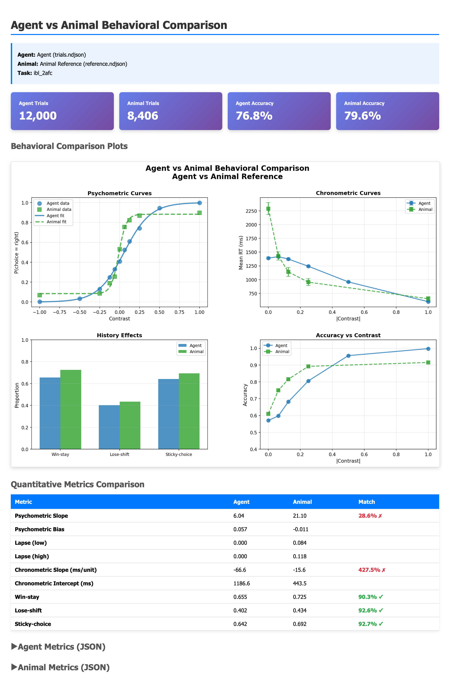

# AnimalTaskSim

[](https://www.python.org/downloads/)
[](https://opensource.org/licenses/MIT)
[](https://github.com/ermanakar/animaltasksim/actions/workflows/ci.yml)
[](https://github.com/astral-sh/ruff)

AnimalTaskSim benchmarks AI agents on classic animal decision-making tasks using task-faithful environments, public reference data, and a schema-locked evaluation stack. The project focuses on matching animal **behavioral fingerprints**—psychometric, chronometric, history, and lapse patterns—rather than raw reward.

## Current Results

<p align="center">
  
</p>

The Hybrid DDM+LSTM agent trained on the IBL mouse 2AFC task simultaneously reproduces intra-trial **and** inter-trial dynamics — a milestone previously unachieved across 60+ experiments (the [Decoupling Problem](FINDINGS.md#the-decoupling-problem)):

- **Win-stay 0.665 ± 0.015** — tendency to repeat after rewards (IBL mouse: 0.724). Validated across 5 seeds (CV = 2.3%)
- **Lose-shift 0.405 ± 0.016** — tendency to switch after errors (IBL mouse: 0.427)
- **Negative chronometric slope** −66.7 ± 2.0 ms/unit — harder stimuli → slower RTs
- **Psychometric sensitivity** — sigmoidal choice curve with slope 6.3 ± 0.4 (IBL mouse: ~13.2)
- **100% commit rate** with realistic RT range (530–1200 ms)

The key insight: history effects require **drift-rate bias** (history modulates evidence accumulation), not just starting-point bias (which only affects ambiguous trials). See [FINDINGS.md Phase 8](FINDINGS.md) for the full analysis.

> *Figure from `runs/ibl_drift_v6_max/`. Dashboard: `python scripts/make_dashboard.py --opts.agent-log runs/ibl_drift_v6_max/trials.ndjson --opts.reference-log data/ibl/reference.ndjson --opts.output dashboard.html`*

---

## New to the Project?

- 📘 **[Theory & Concepts Guide](docs/THEORY_AND_CONCEPTS.md)** — Accessible introduction covering the tasks, behavioral fingerprints, and the hybrid DDM+LSTM model
- **[Findings Report](FINDINGS.md)** — Experimental results across 60+ runs, what works, what doesn't
- 💻 **[Agent Operating Guide](AGENTS.md)** — Implementation standards and contribution guidelines
- ⚡ **[Quick Start](#quickstart)** — Jump straight to running experiments

---

## Project Overview

AnimalTaskSim provides:

- **Task-faithful Gymnasium environments** that mirror lab protocols and timing for the IBL mouse 2AFC and macaque RDM tasks
- **Baseline agents** (Sticky-Q, Bayesian observer, PPO) and advanced agents (Hybrid DDM+LSTM, R-DDM) with deterministic seeding
- **Schema-validated trial logging** — one JSON object per trial using a frozen `.ndjson` schema
- **Evaluation scripts** that score behavioral fingerprints against reference datasets and render HTML dashboards
- **Experiment registry** for tracking and comparing runs

The code is designed so future tasks (PRL, DMS) can be added without breaking existing interfaces.

---

## Reference Data

AnimalTaskSim benchmarks against two canonical datasets from decision neuroscience:

### IBL Mouse 2AFC

**Source:** International Brain Laboratory (IBL) standardized protocol
**Task:** Two-alternative forced choice with varying visual contrasts
**Species:** Laboratory mice across multiple institutions
**Citation:** [International Brain Laboratory (2021). *Neuron*](https://doi.org/10.1016/j.neuron.2021.04.001)

The IBL dataset provides reproducible measurements of mouse decision-making behavior with controlled contrast levels, block structure, and lapse regimes. `data/ibl/reference.ndjson` bundles 10 public IBL sessions (8,406 trials); the legacy single-session log is available as `data/ibl/reference_single_session.ndjson`.

### Macaque Random-Dot Motion

**Source:** Shadlen lab perceptual decision-making studies
**Task:** Random-dot motion (RDM) direction discrimination
**Species:** Rhesus macaques
**Citations:**

- [Britten et al. (1992). *Journal of Neuroscience*](https://doi.org/10.1523/JNEUROSCI.12-12-04740.1992)
- [Palmer, Huk & Shadlen (2005). *Journal of Vision*](https://doi.org/10.1167/5.5.1)

The macaque RDM data captures the relationship between motion coherence, reaction times, and accuracy. These studies established the neural basis of evidence accumulation in area MT and inspired the drift-diffusion model framework used in our hybrid agent.

---

## Quickstart

### Installation

```bash
pip install -e ".[dev]"
```

### Interactive Workflow (Recommended) ⭐

```bash
python scripts/run_experiment.py
```

This guides you through selecting a task, choosing an agent, configuring parameters, training, evaluation, dashboard generation, and registry update.

### Manual Workflow

```bash
# 1. Train an agent
python scripts/train_agent.py --env ibl_2afc --agent ppo --episodes 5 --seed 42 --out runs/my_experiment

# 2. Evaluate behavioral metrics
python scripts/evaluate_agent.py --run runs/my_experiment

# 3. Generate interactive dashboard
python scripts/make_dashboard.py \
  --opts.agent-log runs/my_experiment/trials.ndjson \
  --opts.reference-log data/ibl/reference.ndjson \
  --opts.output runs/my_experiment/dashboard.html

# 4. Update experiment registry
python scripts/scan_runs.py --overwrite

# 5. Query results
python scripts/query_registry.py show --run-id my_experiment
```

### Experiment Registry

```bash
python scripts/query_registry.py list                                       # All experiments
python scripts/query_registry.py list --task rdm_macaque --agent hybrid_ddm_lstm  # Filtered
python scripts/query_registry.py show --run-id my_experiment                # Detail view
python scripts/query_registry.py export --output experiments.csv            # CSV export
```

The registry (`runs/registry.json`) tracks task, agent, seed, training parameters, behavioral metrics, file paths, status, and timestamps.

---

## Repository Layout

```text
animal-task-sim/
├─ envs/                # Gymnasium tasks + timing utilities
├─ agents/              # Sticky-Q, Bayesian observer, PPO, hybrid DDM, R-DDM agents
├─ animaltasksim/       # Core utilities (config, logging, seeding, registry)
├─ eval/                # Metrics, schema validator, HTML report tooling
├─ scripts/             # Train / evaluate / report CLIs (frozen interfaces)
├─ data/                # Reference animal logs and helpers
├─ tests/               # Env/agent/metric + schema unit tests (80+)
├─ docs/                # Documentation and guides
└─ runs/                # Generated configs, logs, metrics, dashboards
   ├─ archive/          # Archived experimental runs
   └─ registry.json     # Experiment database
```

---

## Task Snapshots

### Mouse 2AFC (IBL)

- Discrete (`left`, `right`, `no-op`) actions; contrast-driven observations in [-1, 1].
- Block priors and lapse regimes match the reference dataset; priors hidden by default.
- Sessions run for fixed trial counts and log per-phase timing.

### Macaque RDM

- Motion coherence observations with optional go-cue phases.
- Actions: `left`, `right`, `hold`, with optional per-step costs.
- Supports collapsing bounds and chronometric metrics for RT alignment.

---

## Evaluation Stack

- `scripts/train_agent.py` seeds Python/NumPy/Torch and saves configs alongside logs.
- `scripts/evaluate_agent.py` computes psychometric, chronometric, history, and bias metrics, writing `metrics.json`.
- `scripts/make_dashboard.py` renders interactive HTML dashboards that juxtapose agent and reference curves.
- `scripts/compare_runs.py` scans all runs and produces a color-coded multi-run leaderboard.
- `eval/schema_validator.py` guards the `.ndjson` contract; `tests/test_schema.py` keeps regressions from landing.

---

## Guiding Principles

- **Fidelity over flash:** copy lab timing, priors, and response rules exactly.
- **Fingerprints over reward:** success = matching bias, RT, history, lapse statistics.
- **Reproducibility:** deterministic seeds, saved configs, and schema-validated logs.
- **Separation of concerns:** environments, agents, metrics, and scripts remain decoupled.

---

## Reproducibility

Every experiment is fully reproducible via fixed seeds, saved `config.json`, schema-validated logs, and registry tracking. To reproduce:

```bash
python scripts/query_registry.py show --run-id EXPERIMENT_NAME  # View config
python scripts/train_agent.py --seed SEED --env TASK --agent AGENT ...  # Re-run
```

---

## Recent Highlights

### February 2026 — Decoupling Problem Partially Solved

The Decoupling Problem — no agent simultaneously captures intra-trial dynamics (chronometric slope) AND inter-trial dynamics (history effects) — is partially solved:

1. **IBL mouse adaptation**: The Hybrid DDM+LSTM now supports both macaque RDM (`--task rdm`) and IBL mouse 2AFC (`--task ibl_2afc`) tasks via a single parameterized codebase.
2. **Drift-rate history bias**: Starting-point bias only affects ambiguous trials. Adding drift-rate bias — history modulates evidence accumulation itself — produces history effects across all difficulty levels.
3. **Results** (`runs/ibl_drift_v6_max/`): Win-stay=0.655, lose-shift=0.402, chrono slope=−66.6 ms/unit, 100% commit rate.
4. **Separate history stream**: A dedicated MLP bypassing the LSTM processes (prev_action, prev_reward) → stay_tendency, validated by 14 gradient isolation tests.

### February 2026 — K2 Experiment (Macaque RDM)

The K2 run solved intra-trial dynamics on the macaque task: psych slope=10.7, chrono slope=−270 ms/unit, 100% commit rate. History remained at chance (~0.50), which turned out to match the overtrained macaque reference data (win-stay=0.458).

### February 2026 — Infrastructure

- **WFPT normalization fix**: Both series agree to 6 decimal places.
- **Ceiling-corrected chronometric slope**: Excludes ceiling levels for honest assessment.
- **93 tests** now pass (up from 40).

See [`FINDINGS.md`](FINDINGS.md) for full experimental details across 60+ experiments.

---

## Roadmap (v0.2)

### New Tasks

- **Probabilistic Reversal Learning (PRL):** bias-block reversals with perseveration metrics. Schema extensions already drafted and tested.
- **Delayed Match-to-Sample (DMS):** delay-dependent accuracy and RT metrics.

### Agent Improvements

- **Close the history gap:** Win-stay 0.655 vs target 0.724 — further tuning of drift-rate bias scale, curriculum, and multi-seed validation.
- **Improve psychometric slope on IBL:** Agent slope (6.0) vs mouse (~13.2) — IBL-specific curriculum tuning needed.

---

## Acknowledgements

This project was developed independently outside of academia, with substantial contributions from AI coding assistants (Claude, OpenAI Codex, Google Gemini). It represents a collaboration between human domain expertise and AI implementation capability.

### Scientific Foundation

- **DDM:** Ratcliff & McKoon (2008); Ratcliff & Smith (2016); Wiecki et al. (2013); Navarro & Fuss (2009)
- **Animal data:** International Brain Laboratory (2021, *Neuron*); Britten et al. (1992); Palmer, Huk & Shadlen (2005)
- **History effects:** Urai et al. (2019, *Nature Communications*)

### Open Source

Built with Gymnasium, PyTorch, Stable-Baselines3, Pydantic, and the Scientific Python ecosystem (NumPy, SciPy, pandas, matplotlib).

---

## License

Code is released under MIT; datasets retain their original licenses.

---

## Citation

If you use AnimalTaskSim in your research, please cite:

```bibtex
@software{akar2025animaltasksim,
  author = {Akar, Erman},
  title = {AnimalTaskSim: Hybrid Drift-Diffusion × LSTM Agents Matching Animal Decision Behavior},
  year = {2025},
  url = {https://github.com/ermanakar/animaltasksim},
  version = {0.1.0}
}
```

See [`CITATION.cff`](CITATION.cff) for additional citation metadata and references.
