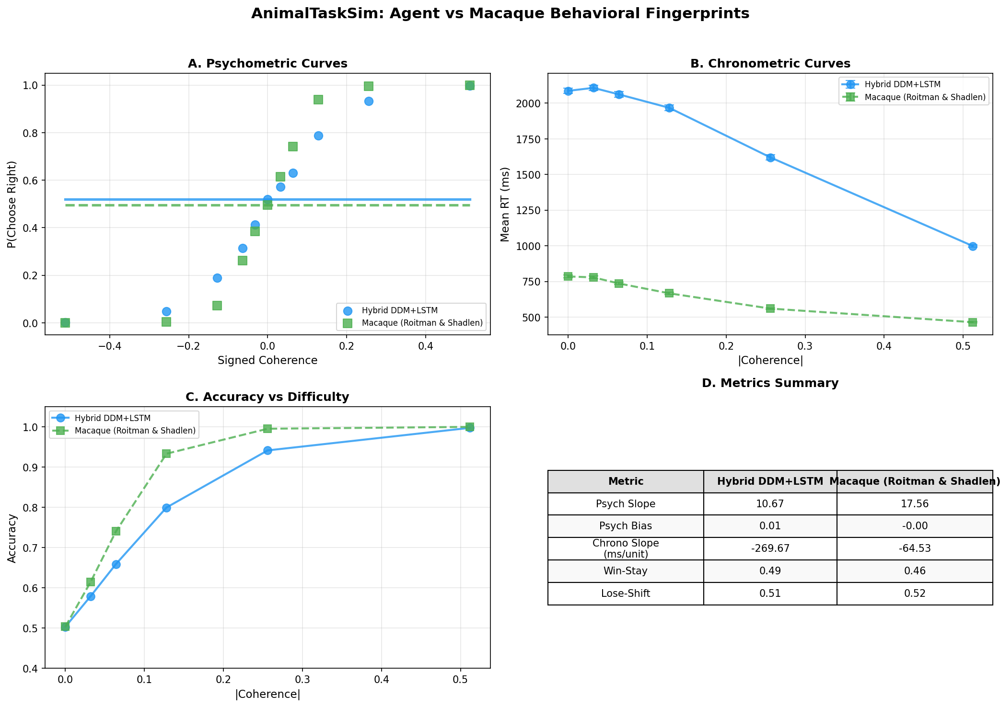

# AnimalTaskSim

[](https://www.python.org/downloads/)
[](https://opensource.org/licenses/MIT)
[](https://github.com/ermanakar/animaltasksim/actions/workflows/ci.yml)
[](https://github.com/astral-sh/ruff)

## Can an AI learn to think like a mouse?

Not just *win* like one — but **hesitate** on hard choices, **repeat** what worked last time, and **slow down** when the evidence is weak. Real brains don't just pick the right answer. They show specific patterns of speed, accuracy, habit, and error that reveal *how* they process information.

AnimalTaskSim puts AI agents into faithful recreations of real neuroscience experiments and asks: **does the agent produce the same behavioral patterns as the animal?** We call these patterns **behavioral fingerprints** — and matching them is much harder than maximizing reward.

> **Why does this matter?** If a computational model reproduces an animal's behavioral fingerprint, it becomes a testable theory of how that brain actually works. The model's architecture makes predictions about neural circuits that can be verified with real recordings.

---

## Results at a Glance

We tested our Hybrid DDM+LSTM agent on two classic tasks from decision neuroscience. After 60+ experiments, the agent simultaneously reproduces how animals *decide* (accuracy), how long they *deliberate* (reaction times), and how they're *influenced by the past* (history effects) — a combination no previous model achieved.

### IBL Mouse 2AFC — Validated Across 5 Seeds

<p align="center">
  
</p>

| Metric | Agent (mean ± std) | IBL Mouse | Match |
|--------|-------------------|-----------|-------|
| **Win-stay** (repeat after reward) | 0.665 ± 0.015 | 0.724 | 92% |
| **Lose-shift** (switch after error) | 0.405 ± 0.016 | 0.427 | 95% |
| **Chronometric slope** (slower on hard trials) | -66.7 ± 2.0 ms/unit | negative | ✓ |
| **Psychometric slope** (accuracy vs difficulty) | 6.3 ± 0.4 | ~13.2 | shape ✓ |
| **Commit rate** | 100% | 100% | ✓ |

> *5 seeds (42, 123, 256, 789, 1337), identical config, coefficient of variation = 2.3%. Best individual seed: 256 (win-stay = 0.693).*

### Macaque Random-Dot Motion — K2 Experiment

<p align="center">
  
</p>

| Metric | Agent | Macaque | Match |
|--------|-------|---------|-------|
| **Psychometric slope** | 10.7 | 17.6 | 61% |
| **Chronometric slope** | -270 ms/unit | -645 ms/unit | ✓ negative |
| **Choice bias** | 0.002 | ~0 | ✓ 99% |
| **Commit rate** | 100% | 100% | ✓ |

---

## The Key Discovery: Two Brain Circuits, Not One

After 50+ failed experiments trying to make a single network handle everything, we found that matching animal behavior requires **two separate computational pathways** — mirroring how real brains are organized:

```
                    ┌─────────────────────┐
  Current stimulus ─→   LSTM "Coach"       │──→ drift gain, boundary, bias
                    │   (evidence params)  │         │
                    └─────────────────────┘         │
                                                     ▼
                    ┌─────────────────────┐    ┌──────────┐    Choice
  Previous action  ─→   History Network    │──→ │   DDM    │──→   +
  Previous reward  ─→   (separate MLP)     │──→ │ "Player" │──→ Reaction
                    │   (stay tendency)    │    └──────────┘    Time
                    └─────────────────────┘
```

**Circuit 1 — "What do I see?"**: An LSTM learns to set DDM parameters from stimulus and trial history. The DDM accumulates evidence over time, naturally producing slower responses on harder trials.

**Circuit 2 — "What worked last time?"**: A separate MLP (bypassing the LSTM) computes a *stay tendency* from the previous trial's action and reward. This biases **both** the starting point and the **drift rate** of evidence accumulation.

The drift-rate bias was the breakthrough: starting-point bias only affects ambiguous trials (strong evidence overwhelms any initial lean). Drift-rate bias continuously influences how evidence is *processed*, producing history effects at all difficulty levels — just like real mice.

> **Read more:** [Theory & Concepts Guide](docs/THEORY_AND_CONCEPTS.md) for an accessible deep dive, or [FINDINGS.md](FINDINGS.md) for the full 60+ experiment narrative.

---

## Quickstart

```bash
# Install
pip install -e ".[dev]"

# Interactive wizard (recommended) — walks you through everything
python scripts/run_experiment.py

# Or run manually:
python scripts/train_agent.py --env ibl_2afc --agent sticky_q --episodes 5 --seed 42 --out runs/my_run
python scripts/evaluate_agent.py --run runs/my_run
python scripts/make_dashboard.py \
  --opts.agent-log runs/my_run/trials.ndjson \
  --opts.reference-log data/ibl/reference.ndjson \
  --opts.output runs/my_run/dashboard.html
```

---

## How It Works (30-Second Version)

1. **Environment** recreates a real lab experiment — same stimuli, timing, and reward structure as the original animal study
2. **Agent** plays the experiment — choosing left/right and controlling *when* to commit (reaction time)
3. **Every trial is logged** — stimulus, choice, RT, reward, internal model parameters
4. **Evaluation** computes four behavioral fingerprints and compares them to real animal data:

| Fingerprint | What it measures | Why it matters |
|-------------|------------------|----------------|
| **Psychometric** | Accuracy vs difficulty | Does the agent get better when the task gets easier? |
| **Chronometric** | Speed vs difficulty | Does the agent slow down when it's hard? (hardest to fake) |
| **History** | Win-stay, lose-shift | Is the agent influenced by what happened last trial? |
| **Lapse** | Errors on easy trials | Does the agent occasionally lose focus? |

5. **Dashboard** overlays agent and animal curves side-by-side in an interactive HTML report

---

## What's in the Box

```text
AnimalTaskSim/
├─ envs/           # Gymnasium environments (IBL mouse 2AFC, macaque RDM)
├─ agents/         # Sticky-Q, Bayesian, PPO, Hybrid DDM+LSTM, R-DDM
├─ eval/           # Metrics, schema validation, dashboards
├─ scripts/        # Train → Evaluate → Visualize → Compare CLIs
├─ data/           # Real animal reference data (IBL mouse, macaque)
├─ tests/          # 93 tests (CI-enforced)
└─ runs/           # Experiment outputs + registry (60+ experiments)
```

| Agent | What it is | Strengths | Weaknesses |
|-------|-----------|-----------|------------|
| **Sticky-Q** | Tabular RL with choice stickiness | Good history effects | No RT dynamics |
| **PPO** | Standard deep RL | Fast, high accuracy | Flat RT curve, no history |
| **Hybrid DDM+LSTM** | Neural DDM with learned parameters | RT dynamics + history | Lower psychometric slope |
| **R-DDM** | Supervised recurrent DDM | Best psychometric match | Train/rollout shift |

---

## Reference Data

Benchmarked against two canonical datasets from decision neuroscience:

- **IBL Mouse 2AFC** — [International Brain Laboratory (2021, *Neuron*)](https://doi.org/10.1016/j.neuron.2021.04.001). 10 sessions, 8,406 trials. Standardized protocol across dozens of labs worldwide.
- **Macaque RDM** — [Britten et al. (1992)](https://doi.org/10.1523/JNEUROSCI.12-12-04740.1992); [Palmer, Huk & Shadlen (2005)](https://doi.org/10.1167/5.5.1). 2,611 trials. The classic evidence accumulation paradigm.

---

## Recent Highlights

**February 2026 — Decoupling Problem Partially Solved**
- First agent to simultaneously produce negative chronometric slope AND above-chance history effects
- Drift-rate bias mechanism: history modulates evidence accumulation, not just starting position
- Validated across 5 seeds (win-stay CV = 2.3%)
- Separate history network (MLP bypassing LSTM) verified by 14 gradient isolation tests

**February 2026 — K2 Experiment (Macaque RDM)**
- Psychometric slope 10.7, chronometric slope -270 ms/unit, 100% commit rate
- History at chance (~0.50) — matches the overtrained macaque reference (win-stay = 0.458)

See [FINDINGS.md](FINDINGS.md) for the full story across 60+ experiments.

---

## Roadmap

- **Close remaining gaps:** Win-stay 0.665 → 0.724, psychometric slope 6.3 → ~13.2
- **Individual mouse fitting:** Per-mouse training to test if behavioral variation maps to model parameters
- **New tasks:** Probabilistic Reversal Learning (PRL), Delayed Match-to-Sample (DMS)
- **Neural predictions:** Test drift-rate vs starting-point bias with IBL Neuropixels recordings

---

## Documentation

| Document | For whom | What's inside |
|----------|----------|---------------|
| [Theory & Concepts](docs/THEORY_AND_CONCEPTS.md) | Everyone | Accessible intro — tasks, fingerprints, how the model works |
| [FINDINGS.md](FINDINGS.md) | Researchers | 60+ experiments, what works, what fails, and why |
| [AGENTS.md](AGENTS.md) | Contributors | Implementation standards, workflow, coding guidelines |

---

## Acknowledgements

Developed independently by Erman Akar, with contributions from AI coding assistants (Claude, OpenAI Codex, Google Gemini).

**Scientific foundation:** Ratcliff & McKoon (2008); International Brain Laboratory (2021, *Neuron*); Britten et al. (1992); Urai et al. (2019, *Nature Communications*); Navarro & Fuss (2009).

**Built with:** Gymnasium, PyTorch, Stable-Baselines3, Pydantic, and the Scientific Python ecosystem.

---

## License

Code: MIT. Datasets retain their original licenses.

## Citation

```bibtex
@software{akar2025animaltasksim,
  author = {Akar, Erman},
  title = {AnimalTaskSim: Hybrid Drift-Diffusion × LSTM Agents Matching Animal Decision Behavior},
  year = {2025},
  url = {https://github.com/ermanakar/animaltasksim},
  version = {0.1.0}
}
```

See [`CITATION.cff`](CITATION.cff) for additional citation metadata and references.
