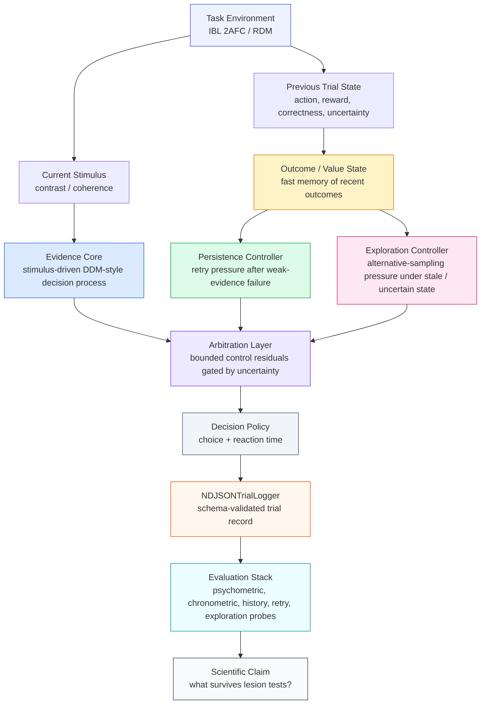

# AnimalTaskSim

**A research simulator for testing animal-like decision agents against real behavioral fingerprints.**

[](https://www.python.org/downloads/)
[](https://github.com/ermanakar/animaltasksim/actions/workflows/ci.yml)
[](https://opensource.org/licenses/MIT)
[](https://github.com/astral-sh/ruff)

AnimalTaskSim recreates animal behavioral tasks, trains agents inside those tasks, writes every trial to schema-validated `.ndjson`, and evaluates behavior against animal-style fingerprints: psychometric curves, chronometric curves, history effects, lapses, and bias. Beyond standard fingerprints, the evaluation stack also runs adaptive-control probes (retry gap, stale-switch lift, hidden-reversal recovery) used to validate the current model.

The project is not a leaderboard. The scientific question is:

> What computational structures are necessary to produce the specific decision patterns observed in biological brains?

## Current Model

The current research path is the **adaptive-control agent**. It is a biologically inspired computational analogy, not a literal brain model.

The agent combines:

1. **Evidence core**: stimulus-driven evidence accumulation for choice and reaction time.
2. **Outcome state**: fast memory of recent actions, rewards, failures, and uncertainty.
3. **Persistence controller**: increases retry pressure after weak-evidence failures.
4. **Exploration controller**: intended to sample alternatives under stale or uncertain conditions; off by default because it is not independently validated.
5. **Arbitration layer**: bounds the control signal so it cannot overwrite strong sensory evidence.

The supported result is narrow but real: **uncertainty-gated adaptive retry/persistence**. The recommended/default adaptive-control profile is `persistence_only`; the exploration component is experimental.

### Scope of the current claim

> **Supported.** Uncertainty-gated adaptive retry / persistence is validated in-simulator. The corrected evaluator bins each retry by the stimulus strength of the failure that actually preceded it. The conservative recommended profile remains `persistence_only`; full control remains useful as a comparison condition.

> **New PRL result.** Exploration first showed an out-of-sample hidden-contingency phenotype in the standalone `exploration_only` lesion: end-of-block optimal choice reaches `0.683`, and block-learning lift exceeds no-control by `+0.307` in 5/5 paired seeds. A follow-up 10-condition, 50-run scale sweep then found that every *combined* full-control variant lost most of that recovery — the arbitration layer over-weighted persistence, so no single profile worked on both tasks. This validated an exploration-specific mechanism lead, not the final combined agent. No anatomical claim is made — the model is a computational analogy.

> **PRL update — the dissociation reverses under the recurrence (opt-in).** The change-evidence recurrence was added to fix the underlying mechanism: PRL's neutral stimulus pinned perceptual uncertainty at `1.0`, so the `uncertain_retry` term perseverated after every failure. With the recurrence on (λ=0.9, `change_evidence_enabled=True`, still **default off**), combined recovery returns and the *driver flips*: `persistence_only` now carries PRL block-learning lift `+0.449` and full control `+0.469` (both 5/5 seeds), while `exploration_only` trails at `+0.232`. This is the opposite ordering to the pre-recurrence May result, where exploration was the sole driver and persistence fell below no-control. In other words, the recurrence's real contribution is un-breaking persistence in PRL, not proving the combined agent needs exploration. It stays opt-in because turning it on slightly lowers the IBL full-control retry gap (`0.175 → 0.158`); `persistence_only` remains the conservative IBL default. Absolute PRL performance is still near chance — this is a necessity/mechanism claim, not "solves PRL".

> **Why this matters.** The same lesion-and-probe pipeline can ask, for any candidate control circuit, whether it is *necessary* to produce a behavioral signature observed in animals. The architecture is a hypothesis; the probe is the test.

## Current Validation

The phase-1 matched suite spans 4 lesion conditions x 5 seeds on IBL mouse 2AFC (20 runs). Every run produces a schema-validated trial log; full per-seed dashboards live under `runs/adaptive_control_validation_suite_phase1_exploration/`.


> **Figure 1 | Full-control comparison run vs. the IBL mouse.** (a) Psychometric: the agent slope (22.3) sits inside the per-session IBL distribution (20.0 +/- 5.7). (b) Chronometric: both decline monotonically with stimulus strength. (c) History: lose-shift matched; win-stay and sticky-choice are directionally correct but trail the mouse by ~0.13 in this seed. This is a comparison view; the clean default claim is persistence/retry.

**Lesion suite (mean over 5 seeds).** *Retry gap* = P(retry | prior weak-evidence failure) - P(retry | prior strong-evidence failure); a positive gap is the signature of uncertainty-gated persistence. *Stale-switch lift* is the exploration controller's isolation probe.

| Condition | Psych slope | Chrono slope | Retry gap | Stale-switch lift |
|-----------|------------:|-------------:|----------:|------------------:|
| No control       | 27.71 | -48.54 | 0.019 | -0.073 |
| Exploration only | 24.00 | -38.83 | 0.205 | -0.160 |
| Persistence only | 21.75 | -33.47 | 0.120 | -0.160 |
| Full control     | 22.26 | -33.97 | 0.175 | -0.152 |

**The validated claim is uncertainty-gated adaptive retry / persistence** — a positive retry gap in every adaptive condition (4/5 seeds paired vs. no-control). `persistence_only` is the recommended default; full control is a comparison condition that also carries the unvalidated exploration controller. Rewarded-streak exploration fails its isolation probe (stale-switch lift negative in 0/5 seeds).

On **PRL** (hidden-contingency reversal), the deficit was localized to `uncertain_retry` perseveration, and the flag-gated change-evidence recurrence (default off; lambda=0.9 opt-in) restores combined recovery. Absolute PRL performance is near chance: this is an isolated necessity/mechanism result, not "solves PRL" (no PRL animal reference dataset exists yet).

**The full record** — paired-delta necessity tests, the exploration probe screens, block-switch adaptation, the interaction and PRL arbitration sweeps, and the change-evidence calibration — is in [FINDINGS.md](FINDINGS.md), with figures under `docs/figures/`.

## Architecture

AnimalTaskSim separates task fidelity, agent behavior, and evaluation. The diagram below is the conceptual model — a biologically inspired computational analogy, not an anatomical claim.


```mermaid
flowchart TB
    T["Task Environment<br/>IBL 2AFC / RDM"] --> S["Current Stimulus<br/>contrast / coherence"]
    T --> H["Previous Trial State<br/>action, reward, correctness, uncertainty"]

    S --> E["Evidence Core<br/>stimulus-driven DDM-style decision process"]
    H --> V["Outcome / Value State<br/>fast memory of recent outcomes"]

    V --> P["Persistence Controller<br/>retry pressure after weak-evidence failure"]
    V --> X["Exploration Controller<br/>alternative-sampling pressure under stale / uncertain state"]

    E --> A["Arbitration Layer<br/>bounded control residuals gated by uncertainty"]
    P --> A
    X --> A

    A --> D["Decision Policy<br/>choice + reaction time"]
    D --> L["NDJSONTrialLogger<br/>schema-validated trial record"]
    L --> M["Evaluation Stack<br/>psychometric, chronometric, history, retry, exploration probes"]

    M --> R["Scientific Claim<br/>what survives lesion tests?"]

    style T fill:#eef2ff,stroke:#3b5bdb
    style E fill:#dbeafe,stroke:#2563eb
    style V fill:#fef3c7,stroke:#d97706
    style P fill:#dcfce7,stroke:#16a34a
    style X fill:#fce7f3,stroke:#db2777
    style A fill:#ede9fe,stroke:#7c3aed
    style D fill:#f1f5f9,stroke:#475569
    style L fill:#fff7ed,stroke:#ea580c
    style M fill:#ecfeff,stroke:#0891b2
    style R fill:#f8fafc,stroke:#334155
```

Repository layout:

```text
envs/           Gymnasium tasks: IBL 2AFC, macaque RDM, PRL, and DMS scaffold
agents/         Adaptive-control agent plus comparison baselines
eval/           Schema validation, behavioral metrics, adaptive-control probes
scripts/        CLI entrypoints for training, evaluation, reports, and validation suites
animaltasksim/  Shared config, logging, seeding, registry, and path utilities
data/           Reference animal datasets
tests/          Unit and integration tests for the pipeline
```

The environment owns logging. Agents never write trial logs directly.

```text
Agent -> Env -> NDJSONTrialLogger -> trials.ndjson -> evaluate_agent.py -> metrics.json
```

Every trial log is validated against the Pydantic schema in `eval/schema_validator.py`. Unexpected schema keys are forbidden.

## Quickstart

```bash
python --version  # use Python 3.11+
pip install -e ".[dev]"
pytest
```

Train one recommended adaptive-control run. `persistence_only` is also the default, but the explicit profile makes the claim boundary visible in saved configs:

```bash
python scripts/train_adaptive_control.py \
  --control-profile persistence_only \
  --output-dir runs/adaptive_control_demo \
  --task ibl_2afc \
  --seed 42 --episodes 5 --epochs 3 \
  --max-sessions 20 --max-trials-per-session 128
```

Run a full-control comparison only when you want the experimental exploration controller enabled:

```bash
python scripts/train_adaptive_control.py \
  --control-profile full_control \
  --output-dir runs/adaptive_control_full_control_demo \
  --task ibl_2afc \
  --seed 42 --episodes 5 --epochs 3 \
  --max-sessions 20 --max-trials-per-session 128
```

Evaluate it:

```bash
python scripts/evaluate_agent.py --run runs/adaptive_control_demo
```

Run the matched validation suite:

```bash
python scripts/adaptive_control_validation_suite.py \
  --run-root runs/adaptive_control_validation_suite_phase1_exploration
```

Run the matched PRL transfer suite. This reuses the IBL-trained evidence core,
then tests zero-shot adaptation when hidden option payouts reverse:

```bash
python scripts/prl_transfer_validation_suite.py \
  --run-root runs/prl_transfer_validation_suite \
  --seeds 42 123 456 789 2026
```

Build an agent-vs-animal dashboard:

```bash
python scripts/make_dashboard.py \
  --opts.agent-log runs/adaptive_control_demo/trials.ndjson \
  --opts.reference-log data/ibl/reference.ndjson \
  --opts.output runs/adaptive_control_demo/dashboard.html
```

## Reference Tasks And Data

| Dataset | Trials | Use |
|---------|--------|-----|
| IBL mouse 2AFC | 86,648 trials, 120 sessions | Main perceptual decision-making reference |
| Macaque RDM | 2,611 trials | Random-dot-motion decision dynamics |
| PRL transfer environment | No animal reference dataset yet | Hidden-contingency adaptation probe |
| DMS environment scaffold | No animal reference dataset yet | Schema-valid memory-task scaffold; adaptive rollout not wired yet |

The IBL reference was expanded from 10 to 120 QC'd public sessions in July 2026 (`scripts/fetch_ibl_reference.py`, `response_times` RT convention, trained-performance QC gate; EID manifest at `data/ibl/reference.manifest.json`). The legacy 10-session set is preserved as `data/ibl/reference_10session.ndjson` so earlier results stay reproducible, and targets are now reported as median [IQR]. See FINDINGS.md "Reference Adoption." Overlay figures above predate the expansion and are rendered against the legacy 10-session reference.

**Data licensing:** the IBL reference is a derived subset of International Brain Laboratory data under **CC-BY 4.0** (repository *code* is MIT). Attribution and required citations are in [`data/README.md`](data/README.md).

IBL contrasts are `{0, 0.0625, 0.125, 0.25, 1.0}`. A previous extra `0.5` contrast was removed after it distorted psychometric fits. Macaque RDM data should not be treated as a history-effect target; the reference animal is overtrained and shows weak sequential effects.

## Scientific Guardrails

- Optimize for behavioral fingerprints, not reward alone.
- Treat protocol fidelity as part of the science.
- Keep `.ndjson` logs schema-validated and reproducible.
- Report negative results; they narrow the hypothesis space.
- Do not overclaim: adaptive control here is a computational analogy, not an anatomy claim.

## Roadmap

A controlled ablation localized the PRL deficit: `uncertain_retry` fires on every PRL failure because neutral options pin uncertainty at 1.0, producing perseveration — so `exploration_only` won by *removing* perseveration, not by exploring. The principled fix is a **change-evidence recurrence** that drives switching from accumulated failures instead of stimulus clarity, implemented behind `change_evidence_enabled` (default off, flag-off verified bit-for-bit). λ=0.9 is the validated opt-in cross-task profile. Full numbers and calibration: [FINDINGS.md](FINDINGS.md); design: [PRL Volatility-Uncertainty Design](docs/prl_volatility_uncertainty_design.md).

Near-term work:

1. Use λ=0.9 as a validated opt-in cross-task profile; keep the feature default off while corrected baselines are re-reported.
2. Inspect reversal-window traces for mechanism work; do not return to global scalar sweeps.
3. Keep `persistence_only` as the conservative default for standard IBL runs.
4. Implement DMS metrics and a memoryless baseline from the defined fingerprint before wiring adaptive rollout.
5. Expand lesion tests for control state, arbitration, evidence preservation, and gate shape.

## Documentation

| Document | Contents |
|----------|----------|
| [FINDINGS.md](FINDINGS.md) | Experimental narrative, failures, corrections, and current claims |
| [Adaptive Control Agent Design](docs/adaptive_control_agent_design.md) | Current adaptive-control architecture and validation status |
| [Adaptive Control Exploration Probe Design](docs/adaptive_control_exploration_probe_design.md) | Follow-up probe design and May 6 falsification screen for unrewarded/volatile exploration |
| [PRL Transfer Design](docs/prl_transfer_design.md) | Hidden-contingency task design, PRL metrics, suite command, and claim boundary |
| [DMS Memory Fingerprint Design](docs/dms_memory_fingerprint_design.md) | Memory-task scorecard, lesions, and prerequisites before adaptive rollout |
| [Theory & Concepts](docs/THEORY_AND_CONCEPTS.md) | Accessible background on tasks, metrics, and model ideas |
| [CHANGELOG.md](CHANGELOG.md) | Version history |

## Built With

Developed with assistance from AI coding tools. Built on PyTorch, Gymnasium, Pydantic, Stable-Baselines3, and the Scientific Python ecosystem.
