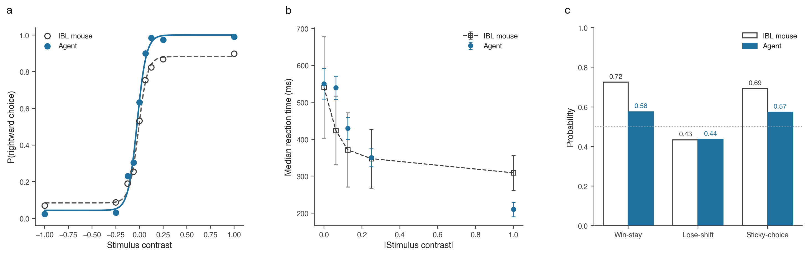
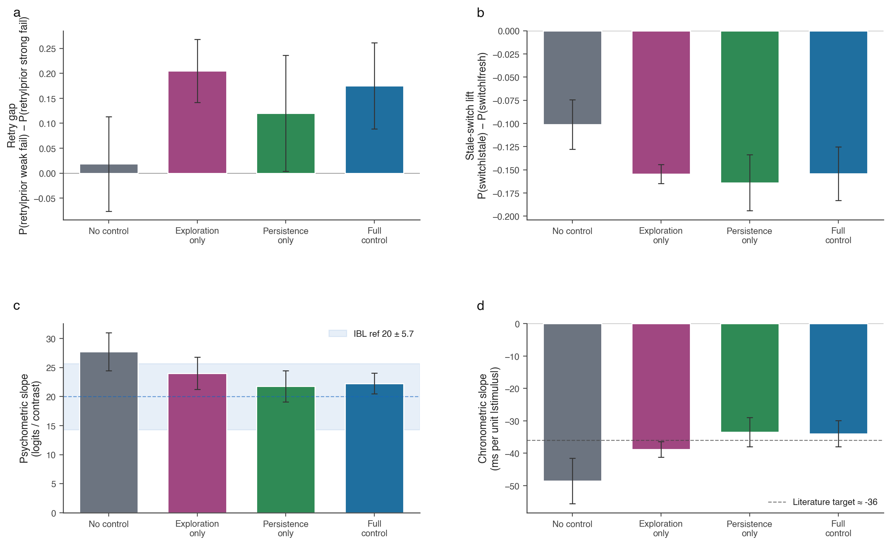
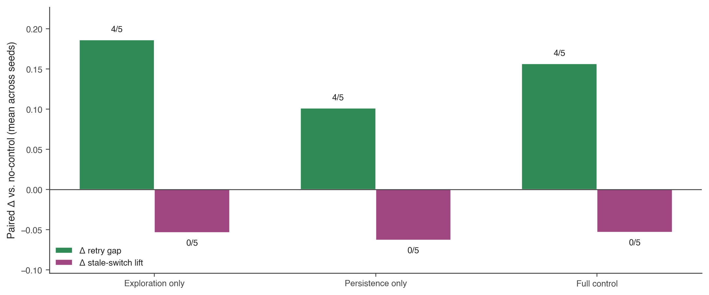
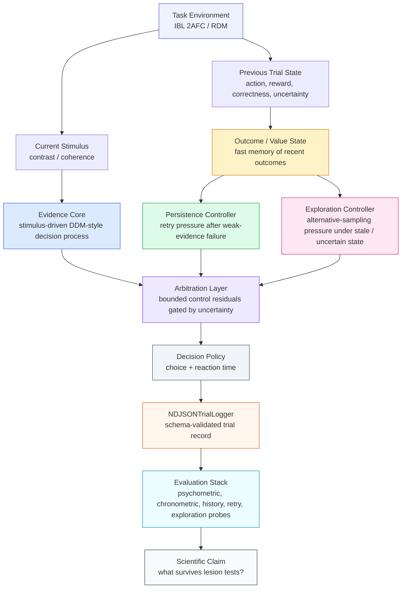

# AnimalTaskSim

**A research simulator for testing animal-like decision agents against real behavioral fingerprints.**

[](https://www.python.org/downloads/)
[](https://opensource.org/licenses/MIT)
[](https://github.com/astral-sh/ruff)

AnimalTaskSim recreates animal behavioral tasks, trains agents inside those tasks, writes every trial to schema-validated `.ndjson`, and evaluates behavior against animal-style fingerprints: psychometric curves, chronometric curves, history effects, lapses, and bias. Beyond standard fingerprints, the evaluation stack also runs adaptive-control probes (retry gap, stale-switch lift) used to validate the current model.

The project is not a leaderboard. The scientific question is:

> What computational structures are necessary to produce the specific decision patterns observed in biological brains?

## Current Model

The current research path is the **adaptive-control agent**. It is a biologically inspired computational analogy, not a literal brain model.

The agent combines:

1. **Evidence core**: stimulus-driven evidence accumulation for choice and reaction time.
2. **Outcome state**: fast memory of recent actions, rewards, failures, and uncertainty.
3. **Persistence controller**: increases retry pressure after weak-evidence failures.
4. **Exploration controller**: intended to sample alternatives under stale or uncertain conditions.
5. **Arbitration layer**: bounds the control signal so it cannot overwrite strong sensory evidence.

The supported result is narrow but real: **uncertainty-gated adaptive retry/persistence**. The exploration component is not yet independently validated.

### Scope of the current claim

> **Supported.** Uncertainty-gated adaptive retry / persistence is validated in-simulator: the full-control agent reliably retries the same choice after a weak-evidence failure, and the effect survives a paired comparison against a clean no-control lesion across 5 seeds.

> **Not yet supported.** Rewarded-streak exploration is not independently validated; its isolation probe failed (0/5 positive seeds on stale-switch lift). No anatomical claim is made — the model is a computational analogy.

> **Why this matters.** The same lesion-and-probe pipeline can ask, for any candidate control circuit, whether it is *necessary* to produce a behavioral signature observed in animals. The architecture is a hypothesis; the probe is the test.

## Current Validation

Latest matched validation run:

```text
runs/adaptive_control_validation_suite_phase1_exploration/
```

### How to read the numbers

- **Retry gap** = P(retry | weak-evidence failure) − P(retry | strong-evidence failure). A positive gap means the agent specifically retries when the prior failure was *not* clearly disambiguated by the stimulus — the signature of uncertainty-gated persistence.
- **Stale-switch lift** = P(switch | stale fresh-pair) − P(switch | fresh fresh-pair). A positive lift means the agent samples alternatives more often when its recent action history has gone stale — the signature of rewarded-streak exploration.
- **Paired delta** = condition − no-control, computed seed-by-seed. Positive-seed counts (e.g. `5/5`) show how consistently the effect reproduces, not just whether the mean has the right sign.
- **Lesion conditions.** *True no-control* disables all adaptive-control machinery; *persistence-only* and *exploration-only* enable one controller at a time; *full control* enables both. The arbitration layer is uncertainty-gated so that none of these can overwrite strong sensory evidence.

| Condition | Psych slope | Chrono slope | Retry gap | Stale-switch lift | RT ceiling warnings | Degenerate |
|-----------|-------------|--------------|-----------|-------------------|---------------------|------------|
| True no-control | 27.71 | -48.54 | 0.057 | -0.073 | 0/5 | 0/5 |
| Exploration-only | 24.00 | -38.83 | 0.092 | -0.160 | 0/5 | 0/5 |
| Persistence-only | 21.75 | -33.47 | 0.164 | -0.159 | 1/5 | 0/5 |
| Full control | 22.26 | -33.97 | 0.165 | -0.152 | 0/5 | 0/5 |

Paired deltas versus the clean no-control lesion:

| Comparison | Delta retry gap | Retry positive seeds | Delta stale-switch lift | Stale-lift positive seeds |
|------------|-----------------|----------------------|-------------------------|---------------------------|
| Exploration-only - no-control | +0.035 | 3/5 | -0.087 | 0/5 |
| Persistence-only - no-control | +0.107 | 3/5 | -0.086 | 0/5 |
| Full control - no-control | +0.109 | 5/5 | -0.079 | 0/5 |

Interpretation:

- Full control reliably increases retry after weak-evidence failure.
- Persistence explains most of that effect.
- Rewarded-streak exploration failed its isolation probe.
- The honest claim is adaptive retry/persistence, not a general exploration breakthrough.

**Behavioral overlay against the IBL mouse** (full control, seed 42):



The psychometric curve sits inside the animal's slope. The chronometric shape tracks the mouse but at a faster absolute RT — agent RTs occupy a different magnitude regime. History effects are in the right direction; win-stay and sticky-choice still trail the mouse, lose-shift is essentially matched.

**Suite-level summary** across all four lesion conditions:



Per-seed paired deltas vs. the no-control lesion:



Full per-condition dashboards live under `runs/adaptive_control_validation_suite_phase1_exploration/` (`suite_dashboard.html`, plus a `dashboard.html` and `report.html` per seed/condition).

## Architecture

AnimalTaskSim separates task fidelity, agent behavior, and evaluation. The diagram below is the conceptual model — a biologically inspired computational analogy, not an anatomical claim.


```mermaid
flowchart TB
    T["Task Environment<br/>IBL 2AFC / RDM"] --> S["Current Stimulus<br/>contrast / coherence"]
    T --> H["Previous Trial State<br/>action, reward, correctness, uncertainty"]

    S --> E["Evidence Core<br/>stimulus-driven DDM-style decision process"]
    H --> V["Outcome / Value State<br/>fast memory of recent outcomes"]

    V --> P["Persistence Controller<br/>retry pressure after weak-evidence failure"]
    V --> X["Exploration Controller<br/>alternative-sampling pressure under stale / uncertain state"]

    E --> A["Arbitration Layer<br/>bounded control residuals gated by uncertainty"]
    P --> A
    X --> A

    A --> D["Decision Policy<br/>choice + reaction time"]
    D --> L["NDJSONTrialLogger<br/>schema-validated trial record"]
    L --> M["Evaluation Stack<br/>psychometric, chronometric, history, retry, exploration probes"]

    M --> R["Scientific Claim<br/>what survives lesion tests?"]

    style T fill:#eef2ff,stroke:#3b5bdb
    style E fill:#dbeafe,stroke:#2563eb
    style V fill:#fef3c7,stroke:#d97706
    style P fill:#dcfce7,stroke:#16a34a
    style X fill:#fce7f3,stroke:#db2777
    style A fill:#ede9fe,stroke:#7c3aed
    style D fill:#f1f5f9,stroke:#475569
    style L fill:#fff7ed,stroke:#ea580c
    style M fill:#ecfeff,stroke:#0891b2
    style R fill:#f8fafc,stroke:#334155
```

Repository layout:

```text
envs/           Gymnasium tasks: IBL 2AFC and macaque RDM
agents/         Adaptive-control agent plus comparison baselines
eval/           Schema validation, behavioral metrics, adaptive-control probes
scripts/        CLI entrypoints for training, evaluation, reports, and validation suites
animaltasksim/  Shared config, logging, seeding, registry, and path utilities
data/           Reference animal datasets
tests/          Unit and integration tests for the pipeline
```

The environment owns logging. Agents never write trial logs directly.

```text
Agent -> Env -> NDJSONTrialLogger -> trials.ndjson -> evaluate_agent.py -> metrics.json
```

Every trial log is validated against the Pydantic schema in `eval/schema_validator.py`. Unexpected schema keys are forbidden.

## Quickstart

```bash
python --version  # use Python 3.11+
pip install -e ".[dev]"
pytest
```

Train one adaptive-control run:

```bash
python scripts/train_adaptive_control.py \
  --output-dir runs/adaptive_control_demo \
  --task ibl_2afc \
  --seed 42 --episodes 5 --epochs 3 \
  --max-sessions 20 --max-trials-per-session 128
```

Evaluate it:

```bash
python scripts/evaluate_agent.py --run runs/adaptive_control_demo
```

Run the matched validation suite:

```bash
python scripts/adaptive_control_validation_suite.py \
  --run-root runs/adaptive_control_validation_suite_phase1_exploration
```

Build an agent-vs-animal dashboard:

```bash
python scripts/make_dashboard.py \
  --opts.agent-log runs/adaptive_control_demo/trials.ndjson \
  --opts.reference-log data/ibl/reference.ndjson \
  --opts.output runs/adaptive_control_demo/dashboard.html
```

## Reference Tasks And Data

| Dataset | Trials | Use |
|---------|--------|-----|
| IBL mouse 2AFC | 8,406 trials, 10 sessions | Main perceptual decision-making reference |
| Macaque RDM | 2,611 trials | Random-dot-motion decision dynamics |

IBL contrasts are `{0, 0.0625, 0.125, 0.25, 1.0}`. A previous extra `0.5` contrast was removed after it distorted psychometric fits. Macaque RDM data should not be treated as a history-effect target; the reference animal is overtrained and shows weak sequential effects.

## Scientific Guardrails

- Optimize for behavioral fingerprints, not reward alone.
- Treat protocol fidelity as part of the science.
- Keep `.ndjson` logs schema-validated and reproducible.
- Report negative results; they narrow the hypothesis space.
- Do not overclaim: adaptive control here is a computational analogy, not an anatomy claim.

## Roadmap

Near-term work:

1. Build a better exploration probe around unrewarded or volatile streaks.
2. Test whether adaptive control transfers to Probabilistic Reversal Learning and Delayed Match-to-Sample.
3. Expand lesion tests for control state, arbitration, evidence preservation, and gate shape.
4. Keep all new tasks compatible with the shared `.ndjson` comparison pipeline.

## Documentation

| Document | Contents |
|----------|----------|
| [FINDINGS.md](FINDINGS.md) | Experimental narrative, failures, corrections, and current claims |
| [Adaptive Control Agent Design](docs/adaptive_control_agent_design.md) | Current adaptive-control architecture and validation status |
| [Theory & Concepts](docs/THEORY_AND_CONCEPTS.md) | Accessible background on tasks, metrics, and model ideas |
| [CHANGELOG.md](CHANGELOG.md) | Version history |

## Built With

Developed with assistance from AI coding tools. Built on PyTorch, Gymnasium, Pydantic, Stable-Baselines3, and the Scientific Python ecosystem.
