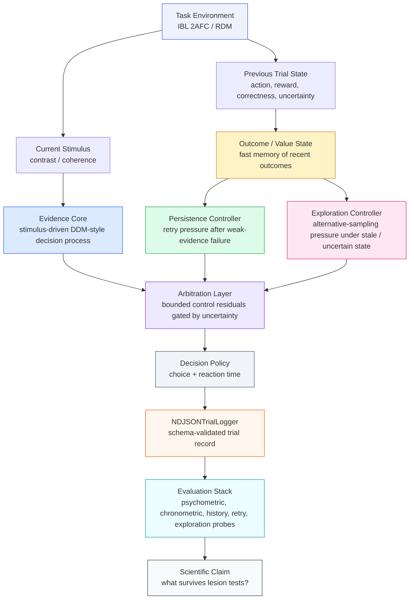

# AnimalTaskSim

**A research simulator for testing animal-like decision agents against real behavioral fingerprints.**

[](https://www.python.org/downloads/)
[](https://github.com/ermanakar/animaltasksim/actions/workflows/ci.yml)
[](https://opensource.org/licenses/MIT)
[](https://github.com/astral-sh/ruff)

AnimalTaskSim recreates animal behavioral tasks, trains agents inside those tasks, writes every trial to schema-validated `.ndjson`, and evaluates behavior against animal-style fingerprints: psychometric curves, chronometric curves, history effects, lapses, and bias. Beyond standard fingerprints, the evaluation stack also runs adaptive-control probes (retry gap, stale-switch lift, hidden-reversal recovery) used to validate the current model.

The project is not a leaderboard. The scientific question is:

> What computational structures are necessary to produce the specific decision patterns observed in biological brains?

## Current Model

The current research path is the **adaptive-control agent**. It is a biologically inspired computational analogy, not a literal brain model.

The agent combines:

1. **Evidence core**: stimulus-driven evidence accumulation for choice and reaction time.
2. **Outcome state**: fast memory of recent actions, rewards, failures, and uncertainty.
3. **Persistence controller**: increases retry pressure after weak-evidence failures.
4. **Exploration controller**: intended to sample alternatives under stale or uncertain conditions; off by default because it is not independently validated.
5. **Arbitration layer**: bounds the control signal so it cannot overwrite strong sensory evidence.

The supported result is narrow but real: **uncertainty-gated adaptive retry/persistence**. The recommended/default adaptive-control profile is `persistence_only`; the exploration component is experimental.

### Scope of the current claim

> **Supported.** Uncertainty-gated adaptive retry / persistence is validated in-simulator. The corrected evaluator bins each retry by the stimulus strength of the failure that actually preceded it. The conservative recommended profile remains `persistence_only`; full control remains useful as a comparison condition.

> **New PRL result.** Exploration first showed an out-of-sample hidden-contingency phenotype in the standalone `exploration_only` lesion: end-of-block optimal choice reaches `0.683`, and block-learning lift exceeds no-control by `+0.307` in 5/5 paired seeds. A follow-up 10-condition, 50-run scale sweep then found that every *combined* full-control variant lost most of that recovery — the arbitration layer over-weighted persistence, so no single profile worked on both tasks. This validated an exploration-specific mechanism lead, not the final combined agent. No anatomical claim is made — the model is a computational analogy.

> **PRL update — the dissociation reverses under the recurrence (opt-in).** The change-evidence recurrence was added to fix the underlying mechanism: PRL's neutral stimulus pinned perceptual uncertainty at `1.0`, so the `uncertain_retry` term perseverated after every failure. With the recurrence on (λ=0.9, `change_evidence_enabled=True`, still **default off**), combined recovery returns and the *driver flips*: `persistence_only` now carries PRL block-learning lift `+0.449` and full control `+0.469` (both 5/5 seeds), while `exploration_only` trails at `+0.232`. This is the opposite ordering to the pre-recurrence May result, where exploration was the sole driver and persistence fell below no-control. In other words, the recurrence's real contribution is un-breaking persistence in PRL, not proving the combined agent needs exploration. It stays opt-in because turning it on slightly lowers the IBL full-control retry gap (`0.175 → 0.158`); `persistence_only` remains the conservative IBL default. Absolute PRL performance is still near chance — this is a necessity/mechanism claim, not "solves PRL".

> **Why this matters.** The same lesion-and-probe pipeline can ask, for any candidate control circuit, whether it is *necessary* to produce a behavioral signature observed in animals. The architecture is a hypothesis; the probe is the test.

## Current Validation

The main phase-1 matched validation suite spans 4 lesion conditions × 5 seeds × 1 task (IBL mouse 2AFC), for 20 independent runs. Every run produces a schema-validated trial log; metrics, dashboards, and per-seed reports live alongside the logs:

```text
runs/adaptive_control_validation_suite_phase1_exploration/
```

### How to read the numbers

- **Retry gap** = P(retry | prior weak-evidence failure) − P(retry | prior strong-evidence failure). A positive gap means the agent specifically retries when the failure that just happened was *not* clearly disambiguated by its stimulus — the signature of uncertainty-gated persistence. A June 1, 2026 evaluator correction fixed older reports that accidentally binned by the next trial's stimulus.
- **Stale-switch lift** = P(switch | stale state) − P(switch | fresh state). A positive lift means the agent samples alternatives more often when its recent action history has gone stale — the signature of rewarded-streak exploration.
- **Unrewarded-switch lift** = P(switch | repeated weak failures) − P(switch | fresh weak evidence). This is a thin-count probe for failure-driven switching, not a claim by itself.
- **Volatile-switch lift** = P(switch | locally mixed recent outcomes) − P(switch | locally stable recent outcomes). This is the more promising follow-up readout, but it must beat the persistence-only lesion to validate exploration.
- **Block-switch adaptation lift** = P(choice follows the new hidden prior on trials 6-10 after a block switch) − P(choice follows the new hidden prior on trials 1-5). This bridges the stable IBL task to true reversal learning.
- **PRL adaptation lift** = P(optimal choice on trials 6-10 after a hidden payout reversal) − P(optimal choice on trials 1-5). The PRL environment shows neutral options; the agent must infer change from reward outcomes rather than a visual cue.
- **PRL block-learning lift** = P(optimal choice on the final 20 trials of a hidden-contingency block) − P(optimal choice on trials 1-5 after reversal). This captures slower outcome-driven learning that the immediate 10-trial window can miss.
- **Paired Δ** = condition − no-control, computed seed-by-seed. Positive-seed counts (e.g. `5/5`) show how consistently the effect reproduces, not just whether the mean has the right sign.
- **Lesion conditions.** *No control* disables all adaptive-control machinery; *persistence only* is the recommended/default validated profile; *exploration only* isolates the experimental exploration controller; *full control* enables both for comparison. The arbitration layer is uncertainty-gated so that none of these can overwrite strong sensory evidence.

---

### Behavioral overlay vs. the IBL mouse


> **Figure 1 | Full-control comparison run against the IBL mouse.**
> **(a)** Psychometric curve, P(rightward choice) vs. signed stimulus contrast. Filled circles, agent (full-control, seed 42); open squares, IBL mouse aggregate (10 sessions, n = 8,406 trials). Solid blue and dashed gray curves are sigmoid fits with separate lapse parameters per side. The agent's slope (22.3 logits/contrast) sits inside the per-session IBL distribution (20.0 ± 5.7).
> **(b)** Chronometric curve. Median reaction time vs. |stimulus contrast|, with error bars showing the standard error of the median. Both agent and mouse decline monotonically with stimulus strength; the agent matches the mouse at low contrast and commits faster than the mouse at the highest contrast.
> **(c)** History effects (win-stay, lose-shift, sticky-choice). Hollow bars, mouse; filled blue bars, agent. Lose-shift is matched. Win-stay and sticky-choice are directionally correct (above 0.5) but trail the mouse by roughly 0.13 in this seed; this gap is the agent's main remaining behavioral deficit. This figure is a comparison view; the clean default claim remains persistence/retry.

---

### Lesion suite summary

| Condition | Psych slope | Chrono slope | Retry gap | Stale-switch lift | RT ceiling warnings | Degenerate |
|-----------|-------------|--------------|-----------|-------------------|---------------------|------------|
| No control       | 27.71 | −48.54 |  0.019 | −0.073 | 0/5 | 0/5 |
| Exploration only | 24.00 | −38.83 |  0.205 | −0.160 | 0/5 | 0/5 |
| Persistence only | 21.75 | −33.47 |  0.120 | −0.160 | 1/5 | 0/5 |
| Full control     | 22.26 | −33.97 |  0.175 | −0.152 | 0/5 | 0/5 |


> **Figure 2 | Per-condition behavioral readouts across the lesion suite.** Bars are means across n = 5 seeds; error bars are 1 s.d.
> **(a)** Retry gap is positive in every adaptive condition, with full control highest in this suite.
> **(b)** Stale-switch lift remains negative in every condition, and is more negative in the adaptive conditions than under no control — i.e. the exploration controller fails its isolation probe in this design.
> **(c)** Psychometric slope. Shaded band marks the IBL per-session reference (20.0 ± 5.7). Adding adaptive control reduces slope from the no-control level into the animal's distribution, at the cost of evidence sensitivity.
> **(d)** Chronometric slope. Dashed line marks the literature target (≈ −36 ms / unit |stimulus|). All adaptive conditions land near the target.

---

### Necessity test: paired deltas vs. no control

| Comparison                          | Δ retry gap | Retry positive seeds | Δ stale-switch lift | Stale-lift positive seeds |
|-------------------------------------|------------:|---------------------:|--------------------:|--------------------------:|
| Exploration only − no control       |      +0.186 |                  4/5 |              −0.087 |                       0/5 |
| Persistence only − no control       |      +0.101 |                  4/5 |              −0.087 |                       0/5 |
| Full control − no control           |      +0.157 |                  4/5 |              −0.078 |                       0/5 |


> **Figure 3 | Paired lesion deltas vs. the no-control lesion** (n = 5 seeds, paired by seed). Each bar pair shows the per-condition mean change in retry gap (green) and stale-switch lift (purple) relative to the same seed's no-control run. Numbers above and below bars are positive-seed counts (n/N): how many of the five seeds showed an effect in the expected direction.
> Full control produces a positive Δ retry gap in **4/5** seeds. In contrast, Δ stale-switch lift is negative in **0/5** seeds across every adaptive condition: rewarded-streak exploration is not validated by this probe.

---

### Interpretation

- The validated claim is persistence/retry: the persistence-only profile keeps the mechanism isolated from experimental exploration.
- Full control is retained as a comparison condition and has the largest retry-gap mean in this suite, but it also includes the unvalidated exploration controller.
- Rewarded-streak exploration fails its isolation probe in every condition (Fig 2b, Fig 3).
- The honest claim is **uncertainty-gated adaptive retry / persistence**, not a general exploration breakthrough. The exploration mechanism needs a different probe, a different gate, or both.

Full per-condition HTML dashboards (one per seed) live under `runs/adaptive_control_validation_suite_phase1_exploration/`.

### Follow-up exploration probe screen

A May 6, 2026 falsification screen tested the newer unrewarded-failure and local-volatility probes across the same four lesion conditions:

```text
runs/adaptive_control_exploration_probe_5seed/
```

This run used a lightweight budget (`episodes=3`, `epochs=1`) to check counts and directionality before spending a larger validation budget. All four conditions remained usable: 0/5 degenerate runs and 0/5 RT-ceiling warnings.

The retry-gap columns in this May screen and the interaction table below
predate the June 1 prior-trial correction. They are retained for provenance and
must not be compared directly with the corrected current suite.

| Comparison | Delta retry gap | Retry positive seeds | Delta unrewarded-switch lift | Unrewarded positive seeds | Delta volatile-switch lift | Volatile positive seeds |
|------------|-----------------|----------------------|------------------------------|---------------------------|----------------------------|-------------------------|
| Exploration only - no control | +0.038 | 3/5 | +0.037 | 4/5 | +0.054 | 3/5 |
| Persistence only - no control | +0.082 | 5/5 | -0.143 | 2/5 | +0.040 | 3/5 |
| Full control - no control | +0.082 | 5/5 | -0.008 | 4/5 | +0.071 | 4/5 |
| Exploration only - persistence only | -0.044 | 2/5 | +0.180 | 4/5 | +0.014 | 3/5 |
| Full control - persistence only | -0.000 | 2/5 | +0.135 | 4/5 | +0.032 | 4/5 |

Interpretation: the unrewarded-failure probe has too few streak events to carry the claim. The local-volatility probe is more viable, but persistence-only also shows a positive volatility lift versus no-control, so the effect is not cleanly attributable to exploration. Exploration therefore remains experimental; the recommended/default profile stays `persistence_only`.

### Block-switch adaptation screen

A block-switch-focused suite then increased the rollout budget to 6 episodes x 800 trials per run, giving 30 biased block reversals per run:

```text
runs/adaptive_control_block_switch_focus_v1/
```

| Condition | Block-switch adaptation lift | Early new-prior choice | Late new-prior choice | Degenerate |
|-----------|------------------------------|------------------------|-----------------------|------------|
| No control | +0.033 | 0.711 | 0.744 | 0/5 |
| Exploration only | +0.136 | 0.655 | 0.791 | 0/5 |
| Persistence only | +0.099 | 0.669 | 0.768 | 0/5 |
| Full control | +0.084 | 0.677 | 0.761 | 0/5 |

Paired against no-control, exploration-only increased block-switch adaptation by `+0.103` in 5/5 seeds. Paired against persistence-only, exploration-only still improved adaptation by `+0.037` in 4/5 seeds. Full-control did not preserve the effect versus persistence-only (`-0.015`, 0/5 seeds), so this is a promising exploration-specific lead, not yet a clean full-control success.

### Persistence/exploration interaction sweep

We then prioritized the full-control arbitration question before PRL/DMS transfer by sweeping persistence and exploration scales:

```text
runs/adaptive_control_interaction_sweep_v1/
```

| Condition | Persistence scale | Exploration scale | Block-switch lift | Delta vs persistence-only | Positive seeds | Retry gap |
|-----------|-------------------|-------------------|-------------------|---------------------------|----------------|-----------|
| Persistence only | 1.6 | off | +0.099 | baseline | - | 0.091 |
| Exploration only | off | 0.8 | +0.136 | +0.037 | 4/5 | 0.031 |
| Full-control default | 1.6 | 0.8 | +0.084 | -0.015 | 0/5 | 0.067 |
| Full-control persist-half | 0.8 | 0.8 | +0.136 | +0.037 | 5/5 | 0.067 |
| Full-control explore-double | 1.6 | 1.6 | +0.103 | +0.004 | 3/5 | 0.094 |
| Full-control explore-dominant | 0.4 | 1.6 | +0.112 | +0.013 | 4/5 | 0.103 |

Interpretation: the default full-control setting was not broken, but it was over-arbitrated toward persistence for this hidden block-switch readout. Weakening persistence to `0.8` while keeping exploration at `0.8` restored the exploration-only block-switch gain over persistence-only (`+0.037`, 5/5 seeds), with 0/5 degenerate runs and 0/5 RT-ceiling warnings. It is a promising full-control comparison setting, not the new validated default, because its retry gap is weaker than persistence-only.

### PRL transfer result

The five-condition matched PRL suite then tested whether that exploration lead
survives true hidden payout reversals:

```text
runs/prl_transfer_validation_suite/
```

All 25 runs were usable: 5 paired seeds per condition, 1,600 trials and 16
reversals per run, 100% commit rate, and 0/25 degenerate runs.

| Condition | Overall optimal choice | Reward rate | Early optimal choice | End-block optimal choice | Block-learning lift |
|-----------|------------------------|-------------|----------------------|--------------------------|---------------------|
| No control | 0.504 | 0.504 | 0.460 | 0.513 | +0.053 |
| Exploration only | 0.579 | 0.549 | 0.322 | 0.683 | +0.360 |
| Persistence only | 0.469 | 0.479 | 0.472 | 0.492 | +0.019 |
| Full control default | 0.507 | 0.501 | 0.510 | 0.466 | -0.044 |
| Full control persist-half | 0.510 | 0.502 | 0.478 | 0.543 | +0.066 |

The exploration-only condition shows the clearest reversal-learning shape:
strong early perseveration after the hidden swap, followed by recovery as reward
evidence accumulates. Against no-control, end-block optimal choice improves by
`+0.169` and block-learning lift by `+0.307`, both positive in 5/5 paired seeds.
Against persistence-only, block-learning lift improves by `+0.341`, also
positive in 5/5 seeds.

Interpretation: exploration has a real task-transfer phenotype when isolated.
The current combined controller is still unresolved: persistence suppresses
most of the PRL benefit, and `full_control_persist_half` is not sufficient to
rescue it. This is a useful mechanism result, not animal parity: the repository
does not yet include a PRL animal reference dataset.

### PRL arbitration scale sweep

The follow-up interaction sweep tested whether global persistence/exploration
scale changes were enough to rescue the combined controller:

```text
runs/prl_adaptive_control_interaction_sweep_v1/
```

All 50 runs were usable: 10 conditions x 5 paired seeds, 80,000 schema-valid
trials, 100% commit rate, and 0/50 degenerate runs. The saved checkpoints stayed
close to their configured scale values, so the negative result is not an
artifact of training collapsing the grid back to one setting.

| Full-control condition | Persistence scale | Exploration scale | End-block optimal choice | Block-learning lift |
|------------------------|-------------------|-------------------|--------------------------|---------------------|
| Default | 1.6 | 0.8 | 0.466 | -0.044 |
| Persist-half | 0.8 | 0.8 | 0.543 | +0.066 |
| Persist-quarter | 0.4 | 0.8 | 0.459 | -0.094 |
| Explore-strong | 1.6 | 1.2 | 0.444 | -0.126 |
| Explore-double | 1.6 | 1.6 | 0.534 | +0.057 |
| Balanced | 0.8 | 1.2 | 0.445 | -0.080 |
| Explore-dominant | 0.4 | 1.6 | 0.454 | -0.016 |

For comparison, `exploration_only` reaches `0.683` end-block optimal choice and
`+0.360` block-learning lift. Every full-control setting loses block-learning
lift versus `exploration_only` in 5/5 paired seeds. The next step was therefore
not another scalar sweep: inspect controller contributions around reversals and
test a state-dependent arbitration rule that lets exploration act when hidden
contingencies change without disabling the IBL retry phenotype.

The checkpoint-reroll diagnostic used for that investigation is:

```bash
python scripts/prl_arbitration_diagnostic.py \
  --source-root runs/prl_adaptive_control_interaction_sweep_v1 \
  --output-root runs/prl_arbitration_diagnostic_v1
```

This reuses three informative saved profiles across the same five seeds and
writes `control_diagnostics.ndjson` beside each diagnostic reroll. The sidecar
contains internal controller traces for offline analysis; `trials.ndjson`
remains the authoritative schema-validated behavioral log.

## Architecture

AnimalTaskSim separates task fidelity, agent behavior, and evaluation. The diagram below is the conceptual model — a biologically inspired computational analogy, not an anatomical claim.


```mermaid
flowchart TB
    T["Task Environment<br/>IBL 2AFC / RDM"] --> S["Current Stimulus<br/>contrast / coherence"]
    T --> H["Previous Trial State<br/>action, reward, correctness, uncertainty"]

    S --> E["Evidence Core<br/>stimulus-driven DDM-style decision process"]
    H --> V["Outcome / Value State<br/>fast memory of recent outcomes"]

    V --> P["Persistence Controller<br/>retry pressure after weak-evidence failure"]
    V --> X["Exploration Controller<br/>alternative-sampling pressure under stale / uncertain state"]

    E --> A["Arbitration Layer<br/>bounded control residuals gated by uncertainty"]
    P --> A
    X --> A

    A --> D["Decision Policy<br/>choice + reaction time"]
    D --> L["NDJSONTrialLogger<br/>schema-validated trial record"]
    L --> M["Evaluation Stack<br/>psychometric, chronometric, history, retry, exploration probes"]

    M --> R["Scientific Claim<br/>what survives lesion tests?"]

    style T fill:#eef2ff,stroke:#3b5bdb
    style E fill:#dbeafe,stroke:#2563eb
    style V fill:#fef3c7,stroke:#d97706
    style P fill:#dcfce7,stroke:#16a34a
    style X fill:#fce7f3,stroke:#db2777
    style A fill:#ede9fe,stroke:#7c3aed
    style D fill:#f1f5f9,stroke:#475569
    style L fill:#fff7ed,stroke:#ea580c
    style M fill:#ecfeff,stroke:#0891b2
    style R fill:#f8fafc,stroke:#334155
```

Repository layout:

```text
envs/           Gymnasium tasks: IBL 2AFC, macaque RDM, PRL, and DMS scaffold
agents/         Adaptive-control agent plus comparison baselines
eval/           Schema validation, behavioral metrics, adaptive-control probes
scripts/        CLI entrypoints for training, evaluation, reports, and validation suites
animaltasksim/  Shared config, logging, seeding, registry, and path utilities
data/           Reference animal datasets
tests/          Unit and integration tests for the pipeline
```

The environment owns logging. Agents never write trial logs directly.

```text
Agent -> Env -> NDJSONTrialLogger -> trials.ndjson -> evaluate_agent.py -> metrics.json
```

Every trial log is validated against the Pydantic schema in `eval/schema_validator.py`. Unexpected schema keys are forbidden.

## Quickstart

```bash
python --version  # use Python 3.11+
pip install -e ".[dev]"
pytest
```

Train one recommended adaptive-control run. `persistence_only` is also the default, but the explicit profile makes the claim boundary visible in saved configs:

```bash
python scripts/train_adaptive_control.py \
  --control-profile persistence_only \
  --output-dir runs/adaptive_control_demo \
  --task ibl_2afc \
  --seed 42 --episodes 5 --epochs 3 \
  --max-sessions 20 --max-trials-per-session 128
```

Run a full-control comparison only when you want the experimental exploration controller enabled:

```bash
python scripts/train_adaptive_control.py \
  --control-profile full_control \
  --output-dir runs/adaptive_control_full_control_demo \
  --task ibl_2afc \
  --seed 42 --episodes 5 --epochs 3 \
  --max-sessions 20 --max-trials-per-session 128
```

Evaluate it:

```bash
python scripts/evaluate_agent.py --run runs/adaptive_control_demo
```

Run the matched validation suite:

```bash
python scripts/adaptive_control_validation_suite.py \
  --run-root runs/adaptive_control_validation_suite_phase1_exploration
```

Run the matched PRL transfer suite. This reuses the IBL-trained evidence core,
then tests zero-shot adaptation when hidden option payouts reverse:

```bash
python scripts/prl_transfer_validation_suite.py \
  --run-root runs/prl_transfer_validation_suite \
  --seeds 42 123 456 789 2026
```

Build an agent-vs-animal dashboard:

```bash
python scripts/make_dashboard.py \
  --opts.agent-log runs/adaptive_control_demo/trials.ndjson \
  --opts.reference-log data/ibl/reference.ndjson \
  --opts.output runs/adaptive_control_demo/dashboard.html
```

## Reference Tasks And Data

| Dataset | Trials | Use |
|---------|--------|-----|
| IBL mouse 2AFC | 8,406 trials, 10 sessions | Main perceptual decision-making reference |
| Macaque RDM | 2,611 trials | Random-dot-motion decision dynamics |
| PRL transfer environment | No animal reference dataset yet | Hidden-contingency adaptation probe |
| DMS environment scaffold | No animal reference dataset yet | Schema-valid memory-task scaffold; adaptive rollout not wired yet |

IBL contrasts are `{0, 0.0625, 0.125, 0.25, 1.0}`. A previous extra `0.5` contrast was removed after it distorted psychometric fits. Macaque RDM data should not be treated as a history-effect target; the reference animal is overtrained and shows weak sequential effects.

## Scientific Guardrails

- Optimize for behavioral fingerprints, not reward alone.
- Treat protocol fidelity as part of the science.
- Keep `.ndjson` logs schema-validated and reproducible.
- Report negative results; they narrow the hypothesis space.
- Do not overclaim: adaptive control here is a computational analogy, not an anatomy claim.

## Roadmap

A controlled ablation localized the PRL deficit: `uncertain_retry` (retry the failed action when uncertain) fires on every PRL failure because neutral options pin uncertainty at 1.0, producing perseveration. Disabling only that term recovers reversal learning (block-learning lift +0.019 → +0.302, 5/5 seeds), confirming `exploration_only` won by *removing* perseveration, not by exploring. The principled fix — a **change-evidence recurrence** that drives switching from accumulated failures instead of stimulus clarity — is implemented behind `change_evidence_enabled` (default off, flag-off verified bit-for-bit). Safety-gated calibration rejected λ=0.7 as too eager and selected λ=0.9 as a validated opt-in cross-task profile: with `uncertain_retry` still enabled, full-control PRL block-learning lift reached `+0.469` and optimal choice reached `0.706`; after the June 1 prior-trial retry-metric correction, IBL full-control retry gap is `0.158` versus the historical flag-off `0.175`. See [PRL Volatility-Uncertainty Design](docs/prl_volatility_uncertainty_design.md).

Near-term work:

1. Use λ=0.9 as a validated opt-in cross-task profile; keep the feature default off while corrected baselines are re-reported.
2. Inspect reversal-window traces for mechanism work; do not return to global scalar sweeps.
3. Keep `persistence_only` as the conservative default for standard IBL runs.
4. Implement DMS metrics and a memoryless baseline from the defined fingerprint before wiring adaptive rollout.
5. Expand lesion tests for control state, arbitration, evidence preservation, and gate shape.

## Documentation

| Document | Contents |
|----------|----------|
| [FINDINGS.md](FINDINGS.md) | Experimental narrative, failures, corrections, and current claims |
| [Adaptive Control Agent Design](docs/adaptive_control_agent_design.md) | Current adaptive-control architecture and validation status |
| [Adaptive Control Exploration Probe Design](docs/adaptive_control_exploration_probe_design.md) | Follow-up probe design and May 6 falsification screen for unrewarded/volatile exploration |
| [PRL Transfer Design](docs/prl_transfer_design.md) | Hidden-contingency task design, PRL metrics, suite command, and claim boundary |
| [DMS Memory Fingerprint Design](docs/dms_memory_fingerprint_design.md) | Memory-task scorecard, lesions, and prerequisites before adaptive rollout |
| [Theory & Concepts](docs/THEORY_AND_CONCEPTS.md) | Accessible background on tasks, metrics, and model ideas |
| [CHANGELOG.md](CHANGELOG.md) | Version history |

## Built With

Developed with assistance from AI coding tools. Built on PyTorch, Gymnasium, Pydantic, Stable-Baselines3, and the Scientific Python ecosystem.
