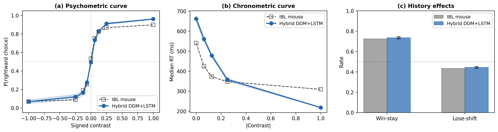

# AnimalTaskSim

**A three-circuit neural architecture that reproduces the full behavioral fingerprint of an IBL mouse during perceptual decision-making.**

[](https://www.python.org/downloads/)
[](https://opensource.org/licenses/MIT)
[](https://github.com/astral-sh/ruff)
[](https://github.com/ermanakar/animaltasksim/actions/workflows/ci.yml)

---

## What Is This?

Real mice in real labs ([International Brain Laboratory](https://www.internationalbrainlab.com/)) make thousands of decisions under uncertainty — and they do it with a distinctive signature: they hesitate when the evidence is weak, repeat choices that were just rewarded, and occasionally zone out on easy trials. This project puts AI agents into faithful recreations of those same experiments and asks whether they can **learn** to produce the same signature — not by being told how a mouse behaves, but by developing the same patterns through training. [Read more &rarr;](docs/THEORY_AND_CONCEPTS.md)

---

## Abstract

Animals make decisions with characteristic patterns of accuracy, speed, history dependence, and error that together form a **behavioral fingerprint**. Reproducing this fingerprint in a computational model is substantially harder than maximizing task reward, because the model must simultaneously capture how stimulus difficulty modulates choice accuracy (psychometric curve), how it modulates reaction time (chronometric curve), how previous outcomes bias future choices (win-stay/lose-shift), and how attentional lapses produce occasional errors on trivial trials.

We present a hybrid Drift-Diffusion Model (DDM) + LSTM architecture with three functionally independent circuits — evidence accumulation, asymmetric history processing, and stochastic lapse — trained end-to-end through a differentiable Euler-Maruyama DDM simulator. On the International Brain Laboratory mouse two-alternative forced choice task, all five behavioral metrics fall within the per-session reference distribution derived from 10 sessions (8,406 trials):

| Metric | Agent (5-seed mean ± std) | IBL Mouse (per-session mean ± std) |
|--------|--------------------------|-----------------------------------|
| Psychometric slope | **17.84 ± 2.08** | 20.0 ± 5.7 |
| Chronometric slope | **-37.7 ± 2.4 ms/unit** | -51 ± 64 ms/unit |
| Win-stay | **0.734 ± 0.022** | 0.72 ± 0.08 |
| Lose-shift | **0.444 ± 0.017** | 0.47 ± 0.10 |
| Lapse rate | **0.086 ± 0.049** | 0.08 ± 0.07 |

This result required 70+ experiments across five agent architectures. The path to this result — including 12 critical failure modes, a co-evolution training requirement, and a protocol fidelity correction that improved psychometric slope by 44% — is documented in full in [FINDINGS.md](FINDINGS.md).

<p align="center">
  
</p>

**Figure 1.** Agent (blue) vs IBL mouse (gray) behavioral fingerprint. **(a)** Psychometric curve: probability of rightward choice as a function of signed contrast. **(b)** Chronometric curve: median reaction time decreases with stimulus strength (negative slope = evidence accumulation). **(c)** History effects: win-stay and lose-shift rates above chance (0.5 dashed line). Shaded regions and error bars show ± SEM across 5 random seeds.

---

## Motivation

Most computational models of decision-making either maximize reward (producing unrealistic step-function psychometric curves) or fit parameters to aggregate statistics (losing trial-by-trial dynamics). Neither approach answers the question this project addresses:

> **What computational structures are necessary to produce the specific decision patterns observed in biological brains?**

If a model reproduces an animal's behavioral fingerprint through its architecture rather than parameter fitting, that architecture becomes a testable theory of how the underlying neural circuits work. The model's components make predictions — about what happens when you lesion specific pathways, about how circuits interact during development, about which behaviors are computationally coupled — that can be verified against real neural recordings.

AnimalTaskSim provides the experimental framework for this approach: faithful recreations of neuroscience tasks, schema-validated trial logging, and a metrics stack that computes psychometric, chronometric, and history statistics directly comparable to published animal data.

---

## Architecture

The model decomposes perceptual decision-making into three independent circuits that mirror known brain organization:

```
  Stimulus features                Previous trial outcome
        │                                    │
        ▼                                    ▼
┌───────────────────┐            ┌─────────────────────────┐
│ Circuit 1:        │            │ Circuit 2:              │
│ Evidence          │            │ History                 │
│                   │            │                         │
│ LSTM (12→64)      │            │ Win MLP   (2→8→1)       │
│   ↓               │            │ Lose MLP  (2→8→1)       │
│ DDM param heads   │            │ Routed by prev_reward   │
│ (drift, bound,    │            │                         │
│  bias, noise,     │            │ Output: stay_tendency   │
│  non-decision)    │            └────────────┬────────────┘
└────────┬──────────┘                         │
         │                          ┌─────────┴─────────┐
         │                          │  Attention gate   │
         │                          │  gate = 1 - |stim|│
         │                          └─────────┬─────────┘
         │                                    │
         └──────────────┬─────────────────────┘
                        ▼
         ┌──────────────────────────────┐
         │  Differentiable DDM          │
         │  Euler-Maruyama, 120 steps   │
         │  Soft boundary (sigmoid)     │
         └──────────────┬───────────────┘
                        ▼
         ┌──────────────────────────────┐
         │  Circuit 3: Lapse (5%)       │
         │  Bernoulli → random choice   │
         └──────────────────────────────┘
                        ▼
                   Choice + RT
```

**Circuit 1 — Evidence accumulation.** An LSTM processes stimulus features and outputs DDM parameters (drift rate, decision bound, starting-point bias, noise, non-decision time). The DDM simulator then accumulates stochastic evidence over 120 Euler-Maruyama steps, producing both a choice and a reaction time. This is what generates the chronometric curve: harder stimuli require more evidence accumulation steps, producing longer reaction times.

**Circuit 2 — History processing.** Two separate MLPs process the previous trial's outcome through independent win and lose pathways, outputting a scalar stay tendency that biases the DDM's drift rate. The asymmetry between pathways (win-stay rate >> lose-shift rate) mirrors the dopaminergic separation between reward and punishment processing in the basal ganglia. An attention gate (`1 - |stimulus|`) suppresses history influence when sensory evidence is strong, preventing mode collapse during joint training.

**Circuit 3 — Attentional lapse.** On approximately 5% of trials, a stochastic Bernoulli gate causes the agent to disengage from evidence accumulation and guess randomly. This is implemented as a fixed parameter applied only during behavioral rollout, not during supervised training (the reference data already contains the animal's own lapse). A learnable lapse parameter was tested and rejected: the optimizer exploited it to ~15%, using random guessing as a shortcut to reduce loss on hard trials.

### Why a differentiable DDM simulator?

Early experiments used analytical DDM equations for gradient computation. This created an exploitable gradient landscape: the agent could push decision bounds toward infinity and drift toward zero, zeroing the reaction-time gradient while maintaining reasonable choice accuracy through the `tanh(κ)` formula. The Euler-Maruyama simulator eliminates this exploit by unrolling evidence accumulation as a sequence of stochastic steps through PyTorch's autograd, forcing the agent to learn genuine evidence accumulation dynamics.

---

## Key Findings

### Co-evolution of evidence and history circuits

Evidence circuits trained without history effects cannot accommodate history injection post-hoc. When a model was calibrated at `drift_magnitude_target=6.0` without history, adding history injection degraded psychometric slope from 12.76 to 10.1. Co-evolution training — where both circuits learn simultaneously from initialization — recovers performance at `drift_magnitude_target=9.0`. The evidence circuit compensates for history interference by learning stronger drift sensitivity.

This parallels a prediction from developmental neuroscience: sensory processing circuits and reward-history circuits must mature together for optimal function.

### Protocol fidelity as a first-order concern

The IBL biased-blocks protocol uses five contrast levels: {0, 0.0625, 0.125, 0.25, 1.0}. Our environment incorrectly included a sixth level (0.5) that does not exist in the experimental protocol. Removing this single stimulus level — with no changes to the model — improved psychometric slope by 44% (12.38 → 17.84) and win-stay rate by 4% (0.706 → 0.734). The spurious contrast diluted the psychometric fit and masked the model's true discriminability.

This is a cautionary result for computational neuroscience: a simulation environment that does not exactly match the experimental protocol can systematically bias all downstream metrics.

### Twelve failure modes documented

Over 70+ experiments, we identified 12 critical failure modes that blocked progress, each requiring specific architectural or training solutions. Selected examples:

| Failure | Root cause | Solution |
|---------|-----------|----------|
| Psychometric slope collapse to ~9.5 | 7-phase WFPT curriculum pushes model into high-noise regime | Simpler 3-phase curriculum |
| History effects stuck at chance | `prev_reward` was always 0.0 due to phase-step timing bug | Fix: `phase_step == 1` (not `== 0`) |
| Win-stay/psych trade-off ceiling | Attention gate leaks history into medium-contrast trials | Architectural limitation (documented) |
| Lapse exploitation to ~15% | Optimizer uses random guessing to reduce hard-trial loss | Fixed lapse (non-learnable) |
| Six months optimizing non-existent targets | Macaque RDM data has no history effects (overtrained animal) | Switched to IBL mouse data |
| History proxy losses converge but produce no behavioral effect | Sigmoid proxy is a different transfer function from DDM | Both loss variants abandoned |

The complete experimental narrative is in [FINDINGS.md](FINDINGS.md).

---

## Limitations

1. **History effects are injected, not learned.** The win-stay and lose-shift tendencies (`inject_win_tendency=0.30`, `inject_lose_tendency=0.15`) are hand-set hyperparameters that bypass the history networks. The networks themselves produce near-zero outputs. The architecture can *express* animal-like history effects, but it cannot yet *discover* them from data.

2. **Single task validation.** Results are validated on IBL mouse 2AFC only. The macaque RDM task produces correct intra-trial dynamics (chronometric slope) but lacks the history effects that are the primary focus of this work (consistent with the overtrained animal in the Roitman & Shadlen dataset). PRL and DMS tasks are not yet implemented.

3. **Lapse variance across seeds.** Lapse rates range from 0.043 to 0.156 across the five validation seeds (mean 0.086 ± 0.049), suggesting the lapse mechanism interacts with training dynamics in ways not fully understood.

4. **Reference target uncertainty.** Per-session chronometric slopes in the IBL data have enormous variance (range: -2 to -202 ms/unit, std ± 64). Any single-number target for this metric should be interpreted cautiously.

---

## Getting Started

```bash
# Install
pip install -e ".[dev]"

# Run the interactive experiment wizard
python scripts/run_experiment.py

# Or train the flagship agent directly
python scripts/train_hybrid_curriculum.py \
    --task ibl_2afc --seed 42 --episodes 20 \
    --drift-scale 10.0 --drift-magnitude-target 9.0 \
    --lapse-rate 0.05 \
    --history-bias-scale 2.0 --history-drift-scale 0.3 \
    --inject-win-tendency 0.30 --inject-lose-tendency 0.15 \
    --no-use-default-curriculum --no-allow-early-stopping \
    --phase1-epochs 15 --phase2-epochs 10 --phase3-epochs 10

# Evaluate
python scripts/evaluate_agent.py --run runs/<run_dir>

# Compare agent vs animal behavior
python scripts/make_dashboard.py \
    --opts.agent-log runs/<run_dir>/trials.ndjson \
    --opts.reference-log data/ibl/reference.ndjson \
    --opts.output runs/<run_dir>/dashboard.html
```

Training runs on CPU in under 20 minutes with less than 4 GB RAM.

---

## Project Structure

```
envs/              Gymnasium environments (IBL 2AFC, macaque RDM)
agents/            Agent implementations (Sticky-Q, Bayes, PPO, DDM, Hybrid DDM+LSTM, R-DDM)
  hybrid_model.py  Three-circuit architecture (LSTM + DDM heads + asymmetric history MLPs)
  hybrid_trainer.py  Curriculum training + Euler-Maruyama rollout
  losses.py        Multi-objective loss (choice, RT, WFPT, history, drift magnitude)
  wfpt_loss.py     Wiener First Passage Time log-likelihood
eval/              Psychometric, chronometric, and history metrics; schema validation
scripts/           CLI entrypoints (all use tyro.cli with dataclass configs)
data/              Reference animal data (IBL: 8,406 trials; macaque: 2,611 trials)
tests/             104 tests (environments, agents, metrics, schema, WFPT)
```

---

## Reference Data

| Dataset | Source | Trials | Sessions | Protocol |
|---------|--------|--------|----------|----------|
| IBL Mouse 2AFC | International Brain Laboratory (2021) | 8,406 | 10 | Biased-blocks contrast discrimination |
| Macaque RDM | Roitman & Shadlen (2002) | 2,611 | — | Random-dot motion coherence |

---

## Documentation

| Document | Contents |
|----------|----------|
| [FINDINGS.md](FINDINGS.md) | 70+ experiments, failure modes, architectural evolution, calibration narrative |
| [Theory & Concepts](docs/THEORY_AND_CONCEPTS.md) | Accessible introduction to tasks, fingerprints, and the hybrid model |
| [CHANGELOG.md](CHANGELOG.md) | Version history and corrections |

---

## Current Research Direction

The immediate frontier is **learned history**: training the asymmetric win/lose networks to discover appropriate stay tendencies from data, replacing the current injected fixed values. This requires either differentiable rollout through the stochastic DDM simulator or a reinforcement learning signal that shapes history-dependent behavior. Beyond this, lesion experiments (systematically removing architectural components) will test the model's predictions about which circuits are necessary for which behavioral features.

---

## Citation

```bibtex
@software{akar2026animaltasksim,
  author = {Akar, Erman},
  title = {AnimalTaskSim: A Three-Circuit Architecture for Reproducing Animal Decision-Making Behavior},
  year = {2026},
  url = {https://github.com/ermanakar/animaltasksim},
  version = {0.2.1}
}
```

---

## Acknowledgements

Developed by Erman Akar with contributions from AI coding assistants (Claude, Codex, Gemini).

**Scientific foundation:** Ratcliff & McKoon (2008); International Brain Laboratory (2021); Britten et al. (1992); Urai et al. (2019); Navarro & Fuss (2009). See [`CITATION.cff`](CITATION.cff) for full references.

**Built with:** PyTorch, Gymnasium, Pydantic, Stable-Baselines3, and the Scientific Python ecosystem.
