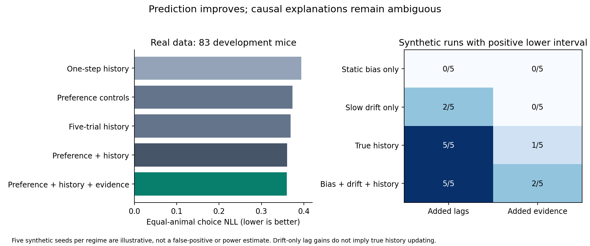

# Causal preference controls and recovery — September 12, 2026

## Result and decision

The common post-prefix sample contains **73,332 trials from 83 development
animals**. Within this sample, preference controls improve prediction and
additional history still contributes.

| Predictor | Equal-animal choice NLL (lower is better) |
|---|---:|
| One-step history | 0.394104 |
| Preference controls | 0.373124 |
| Five-trial history | 0.369122 |
| Preference plus long history | 0.360487 |
| Preference plus long history and evidence | 0.360067 |

The primary evidence gain is **0.000421 nats/trial** (descriptive paired animal-
bootstrap 95% interval **0.000155–0.000695**); 54/83 animals improve. Adding longer
history beyond preference controls gives 0.012636 (0.010233–0.015110); 73/83 improve.
These are incremental predictive gains, not a partition of causal contributions.

### Simulated counterexamples

| Known generator | Positive lower interval for added lags | Positive lower interval for added evidence |
|---|---:|---:|
| Static bias only | 0/5 | 0/5 |
| Slow drift only | **2/5** | 0/5 |
| True history | 5/5 | **1/5** |
| Mixed bias, drift and history | 5/5 | **2/5** |

The slow-drift simulations have no true history update, yet added lags sometimes
look beneficial even after the preference controls. The smaller true evidence
interaction is often missed in the simulated history regimes. These 12-animal
simulations differ from the real 83-animal sample; the counts are not estimates
of real-study power or calibrated false-positive rates. Zero of five false
flags is not proof of specificity.

**Decision: defer a fresh confirmation cohort.** The controls sharpen the
predictive result but do not adequately distinguish the competing generative
explanations. Next compare explicit generative drift/switching and history models
and perform a broader recovery/power study at realistic effect sizes. Do not
interpret the present residual gain as a discovered memory mechanism or change
the confirmation threshold to fit it.

[Plan, all fits, synthetic runs and summaries](results/bias_history_v1.json) ·
[Per-animal real-data scores](results/bias_history_v1_subject_scores.csv)

## Question and fixed design

Does recent history still improve predictions after adding simple, causally
estimated session preference and slow preference controls? This development
experiment follows the [focused literature review](NOVELTY_REVIEW.md), which
identifies strong precedents for history effects and their drift confounds.
It is not a reproduction of PsyTrack, GLM-HMM, or a new method claim.

Six nested logistic predictors share the original stimulus/block and one-step
history controls: one-step, long history, preference controls, preference plus
long history, preference plus evidence, and preference plus both extensions.
The primary contrast is added evidence beyond preference plus long history;
added long history after preference controls is a secondary diagnostic.

A task-only stimulus/block predictor is fitted on the other animals. Within each
session, the first 100 raw trials supply a ridge-regularized bias estimate, with
at least 80 committed prefix choices required. Prefix trials are never scored.
The estimated scalar bias is fixed afterward. Two residual-choice traces at
fixed rates 0.005 and 0.02 update after each observed choice, relative to the
training-only task predictor. They reset at sessions, gaps and omissions.
Every model scores exactly the same post-prefix contiguous-history rows.

All global coefficients are fitted only on the other animals in each of five
fixed animal-disjoint folds. The existing 60 reserved replication animals are
excluded. Ridge, prefix, rates, models, folds and contrasts were recorded before
fitting; no best model or hyperparameter is selected from evaluation scores.

## Plain-language mathematics

The task model estimates how likely a right choice is given the current stimulus
and block. A past choice that differs from that expectation creates a residual:
`residual = observed right choice (0 or 1) − predicted probability`.

Each slow trace updates as `next trace = (1 − rate) × trace + rate × residual`.
The current prediction sees only the previous trace. The session preference is
an intercept estimated from the prefix, accounting for the task model's stimulus
predictions. Final logistic models learn how to use these summaries, with or
without extra lag and evidence terms.

## Recovery diagnostic

Four synthetic regimes are fixed: static session bias, slow random drift,
genuine lag/evidence dependence, and mixed bias/drift/history. Each has five
fixed random seeds, 12 animals and 500 trials per animal, with three animal folds.
All repetitions are retained. We report per-regime gains and how often each
paired animal-bootstrap interval has a positive lower bound.

This is an illustrative recovery diagnostic, not a calibrated significance test
or sample-size calculation. Five repetitions, fixed effect sizes, and simplified
generators do not establish universal identification or power at the much smaller
observed real-data effect. A filter inferred from past responses can capture
both latent bias and actual memory; successful prediction does not identify
which generated real animal behavior.

## Verification and interpretation limits

Independent reconstruction from raw JSON and saved coefficients reproduced all
73,332 real-data trial predictions across six models (maximum probability error
6.6×10⁻¹⁰). Prefix intercepts were independently solved from their score equation.
Plan, source and input hashes, prefix eligibility, folds, and reserved-subject
exclusion all passed. Across descriptive lab means, evidence improves seven of
nine labs; hoferlab and zadorlab are negative. This is not a separate lab-held-out
analysis. The full suite passed 264 tests.

Tests cover prefix-only estimation and exclusion, temporal causality, trace
resets, common model samples, and complete isolation of training from held-out
responses. In particular, changing every held-out response leaves that fold's
task and final model coefficients identical.

Preference is estimated per session, not as a hierarchical animal intercept.
Additive traces do not model engagement-related changes in sensory slope or lapse.
Training traces use the in-sample task fit, whereas held-out traces use an
out-of-sample task fit: outer prediction remains valid, but this stacking
asymmetry limits the interpretation. All models share analyst block information.

Intervals are descriptive animal bootstraps conditional on overlapping training
fits; they omit training-population uncertainty and lab dependence, and multiple
contrasts are not adjusted. The prefix changes the scored sample, so compare
models only within this experiment. No new confirmation cohort should be opened
solely on the basis of these diagnostic controls or simulated successes.

## Reproduction

`OPENBLAS_NUM_THREADS=1 OMP_NUM_THREADS=1 python3 -m scripts.diagnose_bias_history`
requires a fresh output directory and the verified development inputs.
`MPLBACKEND=Agg python3 -m scripts.render_bias_history_figure` regenerates the
figure from the portable result snapshot without re-fitting models.
