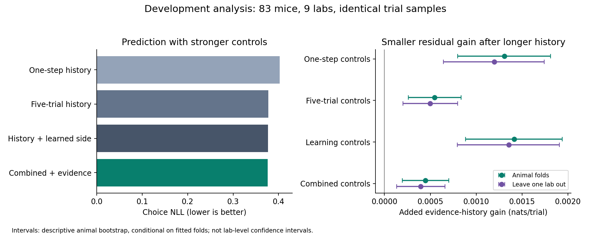

# Competing explanations of choice history — September 12, 2026

This is a new exploratory analysis of the source-reconciled development cohort.
The completed 45-animal replication is preserved, and all 60 reserved candidate
animals are explicitly excluded by subject identity. The question is whether
previous-trial evidence still improves prediction after adding longer histories
and simple reward-derived estimates of the correct side.

## Completed result

Across 84,674 eligible trials from 83 development mice in nine labs, longer
history improves prediction substantially. Previous-trial evidence adds a smaller
residual benefit after these stronger controls.

| Predictor | Animal-fold equal-animal choice NLL |
|---|---:|
| One-step outcome history | 0.402157 |
| Five-trial outcome history | 0.377092 |
| Five-trial history plus learned-side estimates | 0.376723 |
| Combined controls plus evidence interactions | 0.376278 |

The primary evidence gain over combined controls is **0.000445 nats/trial**
(descriptive animal-bootstrap 95% interval **0.000196–0.000703**); 55/83 animals
improve. In the same analysis, the one-step evidence gain is 0.001307. The smaller
increment after longer history does not prove mediation or a neural mechanism.
The stronger history controls themselves improve NLL by 0.025434 relative to
one-step history; 79/83 animals improve. These comparisons use the same trials,
folds, and fitting procedure, but different model capacities.

Leaving out each laboratory during fitting yields a residual evidence gain of
**0.000394** (animal-bootstrap interval **0.000133–0.000662**); 53/83 animals improve.
Mean evidence gain is positive in eight of nine labs under both schemes;
zadorlab is negative (five mice), and mrsicflogellab has only one mouse.
This is a cross-lab prediction sensitivity analysis on already inspected data,
not a new prospective confirmation. The interval still samples animals, not labs.

The defensible conclusion is that a small evidence-history contribution survives
these particular stronger controls. This does not establish that it will survive
all learning models, support the adaptive controller, or establish novelty. The
scores must not be compared directly with the smaller architecture experiment:
that experiment has different data, information access and eligibility rules.

[Plan, coefficients and results](results/competing_history_v1.json) ·
[Animal-fold per-animal scores](results/competing_history_v1_subject_folds_subject_scores.csv) ·
[Lab-fold per-animal scores](results/competing_history_v1_lab_folds_subject_scores.csv)

## Independent verification

An independent reconstruction from raw NDJSON, without importing the study's
preprocessing, reproduced all eligible histories and all predictions from saved
coefficients. Maximum per-trial loss disagreement was below 9×10⁻¹⁶ across
1,354,784 scored rows (84,674 trials × eight models × two fold schemes). Input,
source and plan hashes, reserved-subject exclusion, folds, animal/lab summaries,
and primary bootstrap intervals passed verification. The original replication
plan, fitted-model and source-code hashes also remain unchanged. The complete
repository suite passes **257 tests**, and Ruff passes.

## Fixed comparison

All eight models share the same current-stimulus-by-block controls and previous
outcome/strength nuisance terms. Four paired comparisons add exactly the same two
weak-evidence interactions to different history controls:

| Pair | Additional controls beyond one-step history |
|---|---|
| Original history / evidence | None |
| Long history / evidence | Rewarded and unrewarded choices at lags 2–5 |
| Learning history / evidence | Two fixed-rate leaky correct-side estimates |
| Combined history / evidence | Both longer history and learned-side estimates |

Every model uses the same eligible rows: the current choice and preceding five
choices must be committed and contiguous within the same session. Lags are built
before exclusions. This changes eligibility relative to the original one-step
audit; scores from different studies must not be directly subtracted.

The primary comparison is combined history versus combined history plus evidence.
Positive gain means the evidence model has lower negative log likelihood (NLL).
Five fixed animal-disjoint folds produce one prediction per trial per model.
A second, fixed sensitivity analysis refits the models leaving out one entire
laboratory at a time. Neither scheme selects learning rates or model settings.

## Simple mathematics

Each model turns a weighted sum of its inputs into the probability of choosing
right: `p(right) = 1 / (1 + exp(-score))`. Fitting chooses those weights using only
the other animals in the fitting folds. NLL penalizes confident wrong predictions;
a smaller number is better. Fitting weights trials equally, while reported mean
scores give each animal equal weight.

The learning estimates follow `next estimate = estimate + rate × (observed side − estimate)`.
The two rates are fixed at 0.05 and 0.2. After a committed, nonzero-contrast trial,
the past action and its correctness identify the rewarded side for that past
trial. That information updates the estimate for the next trial only. Estimates
reset at session boundaries, gaps and omissions, and hold unchanged on zero
contrast. They never receive the actual block label or a future outcome.

The evidence extension adds two terms: previous signed choice × previous weak
stimulus, separately for rewarded and unrewarded choices. It tests an incremental
predictive association, not measured subjective confidence.

## Safeguards and limits

The executable plan records input and dependency hashes, folds, sample counts,
fixed settings and interpretation rules before any fits. The runner refuses to
replace an existing result. Independent synthetic tests check temporal leakage,
resets and recovery of lag-only versus lag-plus-evidence effects. These are
positive controls, not a complete model-recovery confusion matrix.

These models all receive true block identity as an analyst control. They test
residual predictive effects conditional on block; they are not autonomous agents.
A small learning-state gain cannot rule out animal block inference when block is
already controlled. The leaky estimates are simple alternatives, not Bayesian
observers or exhaustive representations of learning.

Longer observed history may also proxy persistent side preferences or latent
engagement. These models do not include a hierarchical animal-bias component;
a longer-history gain is not evidence that animals explicitly remember five trials.

Overlapping predictors and fixed ridge penalties do not match effective capacity
or identify unique mechanisms. Animal-bootstrap intervals are descriptive,
conditional on overlapping fitted folds, and omit training-population and
lab-sampling uncertainty. All animals were previously examined; no contrast is a
new confirmation, novelty claim, or proof of the adaptive architecture.

## Reproduction

Run `OPENBLAS_NUM_THREADS=1 OMP_NUM_THREADS=1 python3 -m scripts.compare_history_explanations`
with a fresh output directory. Source inputs are local provenance-checked files;
the completed plan and portable scores will accompany the result. Original
replication artifacts and frozen analysis modules are unchanged.

The figure can be regenerated from the portable snapshot without fitting or
accessing trial data: `MPLBACKEND=Agg python3 -m scripts.render_competing_history_figure`.
