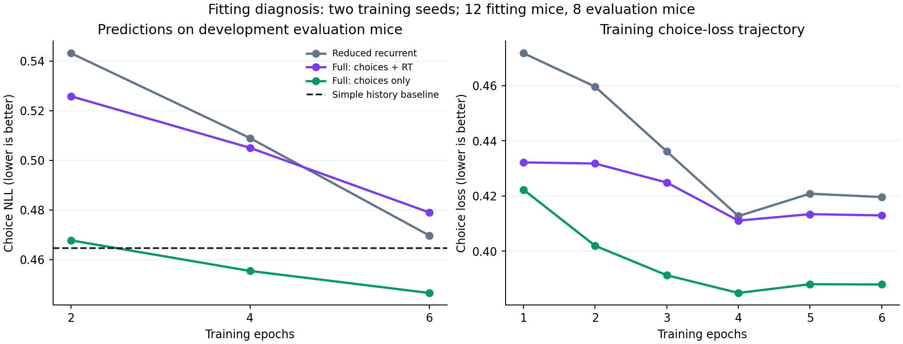

# Fitting diagnosis — September 11, 2026

This follow-up investigates the failed exploratory architecture gate. The same
12 training and eight evaluation animals are now explicitly development data;
revisiting them is not a new prospective confirmation. No previous result or
frozen IBL replication artifact is overwritten.

## Completed result

Longer training and removing direct timing supervision improve choice prediction
in this development experiment. Joint choice/RT validation remains unresolved.

| Predictor | Epochs | Choice NLL (lower is better) | RT MSE (seconds squared) |
|---|---:|---:|---:|
| Simple history baseline | — | 0.464504 | 11.245851 |
| Full adaptive, joint loss | 2 | 0.525795 | 11.626597 |
| Reduced recurrent, joint loss | 6 | 0.469728 | 11.675956 |
| Full adaptive, joint loss | 6 | 0.478999 | 11.659161 |
| Full adaptive, choices only | 6 | 0.446538 | 12.035338 |

These are equal-animal means after averaging the two seeds within each animal:
eight animals contribute choice scores and seven contribute RT scores.

- Continuing the full joint model from two to six epochs improves choice NLL by
  0.04680 nats/trial (animal-bootstrap 95% interval 0.02911–0.06449); all eight
  animals improve. The initial two-epoch screen understated its fitted capacity.
- At six epochs, removing the RT loss improves full-model choice NLL by 0.03246
  (0.01545–0.05123); seven of eight animals improve. This supports interference
  from the current joint fitting objective under these settings.
- The choice-only full model beats simple history by 0.01797 nats/trial
  (0.00169–0.03470); six of eight animals improve. This is encouraging development
  evidence, not a new prospective test.
- The full joint model is worse than the reduced joint model by 0.00927
  (0.00433–0.01540); all eight animals favor the reduced model. The adaptive
  controller's added value is therefore not established.
- Choice-only fitting increases mean RT MSE by 0.37618 compared with full joint
  fitting. The interval for this worsening spans −0.01017 to 0.91260, so the
  direction is uncertain across animals despite the worse aggregate score.

Intervals are exploratory and uncorrected for multiple contrasts. They condition
on this training cohort and do not include training-population or Monte Carlo
uncertainty. The learning curves do not establish convergence.

The next bounded comparison should include a choice-only reduced model, so that
memory and adaptive control can be separated fairly. A scientifically justified
RT observation model is also needed before claiming joint prediction success;
simply removing long responses or changing the scoring rule after seeing results
would not resolve that question.

## Verification and portable evidence

All six fixed fits completed. All four original two-epoch state dictionaries
reproduced exactly. Independent checks recomputed scores against source data for
123,595 prediction rows and verified plan, input and source hashes. The full test
suite passed: **244 tests**. No earlier result was overwritten.

- [Plan, results, timing audits and execution checks](results/fitting_diagnosis_v1.json)
- [Per-animal scores](results/fitting_diagnosis_v1_subject_scores.csv)
- [Training curves](results/fitting_diagnosis_v1_training_curves.csv)
- [Vector figure](figures/fitting_diagnosis_v1.svg)

## Questions fixed before fitting

1. Does continuing training from two to six epochs improve predictions?
2. Does removing the response-time loss improve choice prediction, suggesting
   interference between fitting objectives?
3. Does the adaptive controller still help after the reduced model receives the
   same extra training?

The executable plan is saved before fitting under
`runs/architecture_diagnosis_20260911/experiment/plan.json`, with a companion
SHA-256 digest. The runner is `python3 -m scripts.diagnose_architecture_fitting`.
It requires a new output directory and checks source and input hashes.

## Controlled comparison

| Condition | Architecture | Choice loss weight | RT loss weight |
|---|---|---:|---:|
| raw_no_control | Reduced recurrent | 1 | 1 |
| raw_full_control | Full adaptive | 1 | 1 |
| choice_only_full_control | Full adaptive | 1 | 0 |

Each condition uses seeds 42 and 123 and six epochs, with saved/scored checkpoints
at epochs 2, 4 and 6. Epoch 6 is the primary endpoint; earlier checkpoints describe
the learning trajectory and are not candidates for post-result selection. The
optimizer remains alive across epochs. Data, initialization, architecture size,
training paths, controller regularization and prediction randomness are held
constant. The raw two-epoch weights must exactly match the preceding experiment.

This is a loss-isolation experiment, not a proposed replacement RT model. The
choice-only condition leaves the direct RT objective off; it cannot establish
successful joint choice/RT fitting. All conditions retain the original raw timing
scores, missingness accounting and response-window limits.

Equal-animal means and paired animal bootstrap intervals describe changes. The
comparisons are exploratory, uncorrected for multiple testing and limited to two
seeds. Six epochs do not guarantee convergence. Continuing losses or changing
validation scores must be reported, not called converged by assumption.

## Timing audit

Training contains 14,655 trials, with 11,656 valid RTs and 1,252 outside 50–3000 ms.
Evaluation contains 6,505 trials, with 4,479 valid RTs and 348 outside that range.
One evaluation animal has no valid RTs, so timing summaries use seven animals.

Projecting every observed RT into the allowed window gives a mathematical lower
bound on squared error: 16.32069 seconds squared for pooled training trials and
7.62856 for pooled evaluation trials. This uses knowledge of each observed outcome
and is not an achievable fitted predictor; actual prediction also faces behavioral
variation and incomplete information. It demonstrates an unrepresentable tail,
not the size of gradients or the cause of the choice-prediction deficit.

Full audit details: `runs/architecture_diagnosis_20260911/rt_audit.json`.

## Additional timing diagnostic

The earlier full model's pooled RT MSE is 0.509 seconds squared for observed RTs
within the window, versus 1.717 for the simple predictor. The 348 out-of-window
trials contribute 95.3% of the full model's total squared timing error. This
breakdown averages seeds within trial, then pools trials; it differs from the
original equal-animal score. It is selected after observing the result and
conditions on actual RT, so it is a diagnostic of the trade-off, not a new gate
or evidence that the original timing comparison passed.

Detailed decomposition is in
`runs/architecture_diagnosis_20260911/rt_error_decomposition.json`.

## Scope of the controller comparison

The reduced/full comparison is matched under the original joint loss. This run
does not include a choice-only reduced model. Therefore a choice-only full-model
advantage over the simple baseline would not isolate adaptive control from
recurrent memory. That would require a further matched control; it is not inferred
from the choice-only result here. No added circuit or altered task has been used
in this diagnosis.

## Interpreting loss removal

The simple benchmark fits its choice coefficients independently of its RT
coefficients. The recurrent DDM shares decision parameters across the two
predictions. Removing the RT loss tests that joint fitting constraint; it does
not prove that response times contain no useful information. It also removes
all direct timing supervision, so it does not isolate the long-RT tail as the
sole cause of interference. The timing audit and loss intervention answer
related but different questions.
