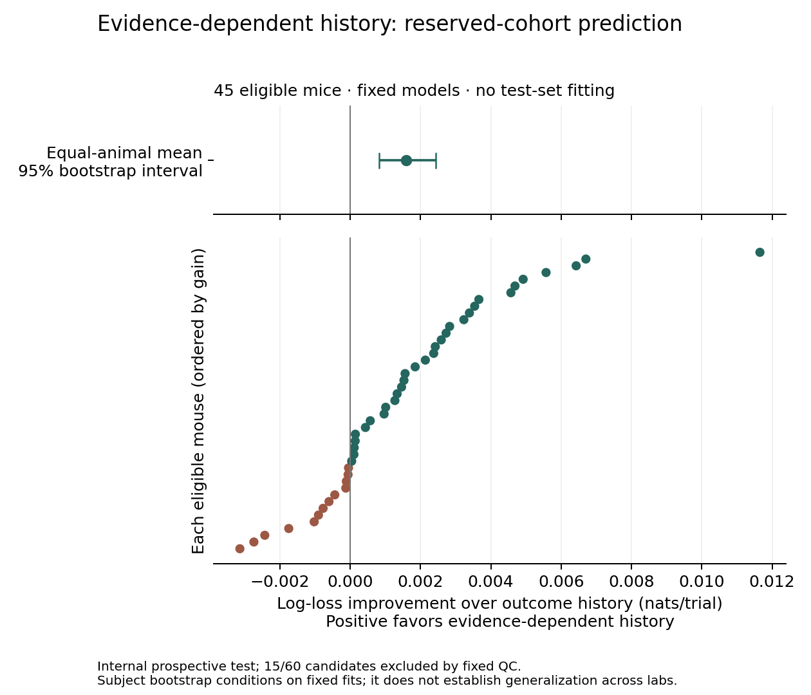

# Reserved-cohort replication result — 11 September 2026

## Result

**The frozen internal test passed.** Adding evidence-dependent outcome history
improved prediction on a new-to-reference cohort, using models fitted only to
the corrected development data. This supports a small predictive contribution
under the specified task controls, not a mechanism or anatomy claim.

| Prespecified measure | Observed | Criterion |
|---|---:|---:|
| Eligible animals | 45 of 60 candidates | At least 40 |
| Mean paired gain, equal weight per animal | 0.001598 nats/trial | At least 0.0005 |
| 95% subject-bootstrap interval | [0.000821, 0.002437] | Lower bound above 0 |
| Animals with improved predictions | 32/45 | Descriptive only |

The eligible cohort contains 32,460 retained trials and 32,071 valid adjacent
choice transitions. All 15 excluded animals failed the prespecified 85%
full-contrast accuracy gate; there were no source-integrity exclusions and no
replacement subjects. Every candidate's QC outcome is retained in the snapshot.

Trial-weighted negative log likelihood was 0.435170 for stimulus/block controls,
0.403205 for outcome history plus nuisance terms, and 0.401661 for evidence-
dependent history. The last comparison is the only primary model test. The
primary equal-animal gain differs slightly from the pooled gain because
animals contribute different trial counts.



## What was frozen and checked

The protocol and three fitted logistic models were frozen on September 6,
before this run downloaded the reserved animals' ALF arrays. Downloads completed
on September 6. Scoring resumed on September 11 after the repository moved to
`Desktop/science/animaltasksim`; every frozen analysis and protocol hash still
matched. There was no earlier saved cohort score. No model was refitted on the
test animals, and no analysis threshold changed.

Frozen plan SHA-256:
`d7af52e560b7a32693e2ad1ef2716ca6bb719bc049f8cefafdbdba0f79d8bb56`.

All 60 downloaded source hashes were checked. Test animal identities are disjoint
from the 90 animals inventoried across all three historical local IBL references.
The scoring runner verifies plan, feature order, models, and source integrity,
and refuses to replace an existing result.

- [Protocol](REPLICATION_PROTOCOL.md)
- [Frozen models, identities, and plan snapshot](results/replication_freeze_2026-09-06.json)
- [Scores, all candidate exclusions, and acquisition hashes](results/replication_result_2026-09-11.json)
- [Development-source correction and exploratory comparison](SOURCE_RECONCILIATION.md)

Local detailed artifacts remain under `runs/ibl_replication_v1/`: the frozen plan,
models, acquisition hashes, eligibility decisions, schema-valid trials, and scores.
The adopted reference and historical snapshots have not been overwritten.

## Limits on the finding

- This was an internal prospective freeze, not external preregistration or a
  protocol committed before scoring. The original session-fold result was
  exploratory, and its known effect informed this test's design.
- The animals are new relative to the saved local reference inventory. Unrecorded
  historical exposure cannot be ruled out, so a provably pristine test set is
  not claimed.
- The sample is uneven across eight eligible labs: 21 of 45 animals are from
  angelakilab. The subject bootstrap conditions on fixed training fits and this
  selected cohort; it does not establish independence across labs or represent
  uncertainty from drawing a new training dataset.
- The effect is small. The additional model includes both rewarded and
  unrewarded evidence interactions, so the gain cannot be assigned solely to
  weak-failure retry. Contrast is not a measurement of subjective uncertainty.
- These are predictions conditioned on observed animal histories and analyst
  block labels, not autonomous agent behavior. No adaptive controller, DDM
  mechanism, reaction-time model, or neural circuit was validated by this test.
- We have not established scientific novelty. A positive frozen prediction test
  is a defensible result to build on, not by itself a publication-ready discovery.

## Recommended next experiment

Preserve this result as a completed test. The next question is whether the
increment reflects evidence dependence itself or a simpler description of
longer outcome history and latent block learning. Compare those explanations
on development animals, with animal/lab sensitivity checks, before reserving
another test cohort. Do not tune on these 45 animals and then present the same
cohort as independent confirmation again.

A focused literature comparison and a competing-model result should precede any
claim of a new mechanism or renewed expansion of the adaptive architecture.

## Reproduce the presentation

```bash
PYTHONPATH=. MPLBACKEND=Agg python scripts/render_ibl_replication_figure.py
```

This rebuilds the PNG/SVG from the tracked result snapshot without fitting or
scoring the cohort again. Full data acquisition and frozen scoring stages are
in `scripts/run_ibl_replication.py`; the existing scored run is intentionally
protected against overwrite.

## Validation

On September 11, the full suite passed **205 tests**; ruff and diff-whitespace
checks passed. All **32,460** eligible cohort trial records passed schema
validation, source and frozen-code hashes matched, and the tracked snapshot
matched the saved score. The standard train/help, train, evaluate, and report
CLI smoke checks ran separately from the research cohort.
