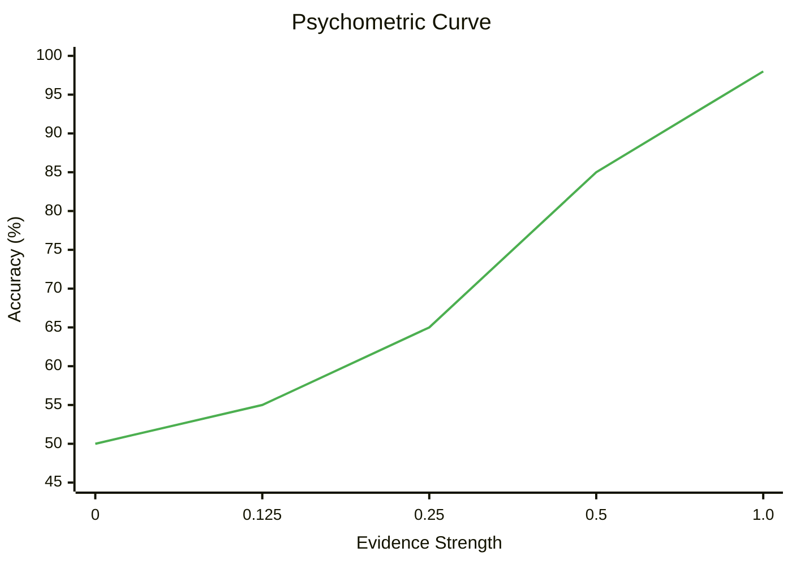
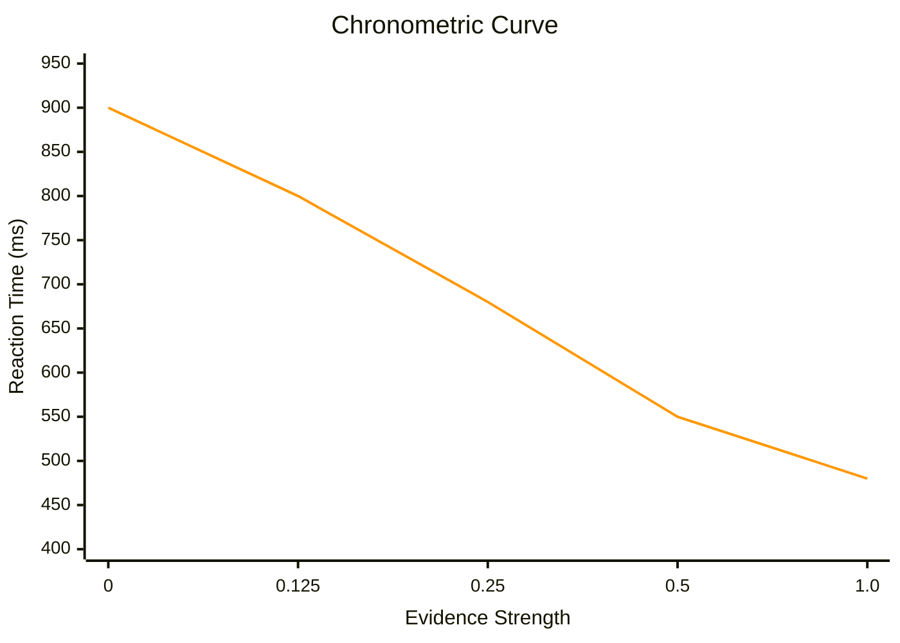
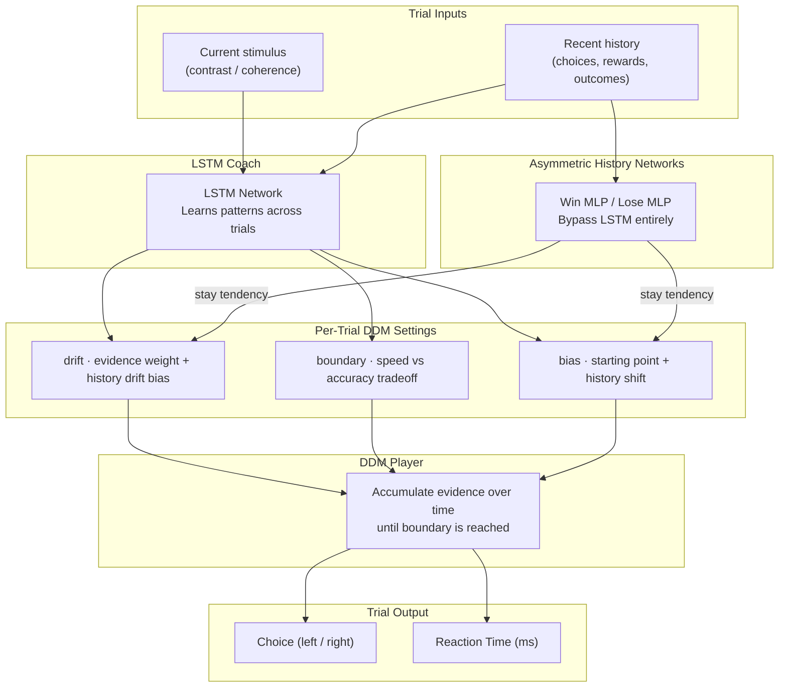
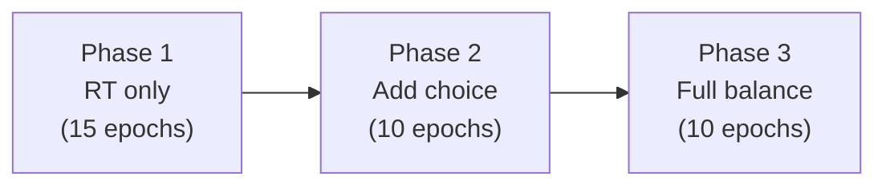

# Understanding AnimalTaskSim

## The Elevator Pitch

Imagine you built a video game — but instead of designing it for humans, you designed it for mice and monkeys. The levels, the rules, the timing, the rewards — everything is modeled on real lab experiments where scientists study how animals make decisions.

Now imagine you put an AI agent into that video game and asked: **does it play the game the way the real animals do?**

Not just "does it win" — but does it hesitate on the hard levels the same way a mouse would? Does it get a little overconfident after a winning streak, the way a monkey does? Does it occasionally mess up on an easy level because it wasn't paying attention?

That's AnimalTaskSim. It's a faithful digital recreation of classic neuroscience experiments, built so we can test whether AI agents can replicate the *specific patterns* of animal decision-making — not just the wins, but the hesitations, the habits, and the mistakes.

---

## Why Would Anyone Do This?

Most AI research asks: *"How do we make the smartest agent possible?"* We ask a different question: *"Can we make an agent that thinks like a real brain?"*

This matters because:

- **For neuroscience:** If a computational model can reproduce an animal's behavior pattern-for-pattern, we may have discovered something about how that animal's brain actually works. The model becomes a testable theory of the brain.
- **For AI:** Agents that behave like biological decision-makers could be more robust, more interpretable, and better at handling uncertainty — all things current AI struggles with.

The key insight is that animals aren't optimal. They're influenced by their recent history, they lose focus, and they take longer on hard decisions. These "imperfections" aren't bugs — they're signatures of how biological brains process information. We call them **behavioral fingerprints**.

---

## The Tasks: What's Inside the Simulator?

AnimalTaskSim faithfully recreates two classic decision-making experiments from neuroscience. Think of the simulator as a video game that replicates the exact conditions of the real lab — same stimuli, same timing, same reward structure — but with an AI agent in place of the animal.

### Task 1: Mouse Visual Contrast Discrimination (IBL 2AFC)

Based on a standardized protocol developed by the [International Brain Laboratory](https://doi.org/10.1016/j.neuron.2021.04.001), replicated across dozens of labs worldwide.

**The experiment:** A mouse sits in front of a screen with a small wheel. A visual grating (a striped pattern) appears at varying contrast levels on either the left or right side. The mouse turns the wheel to indicate where the stimulus appeared. Correct response → water reward. Incorrect → brief timeout.

**The key variable: contrast.** Sometimes the grating is bold and obvious (high contrast). Sometimes it's so faint it's barely visible (low contrast). This controls the difficulty — exactly the way you'd tune a difficulty setting in a game, except here it's grounded in the visual psychophysics of the real experiment.

**In the simulator:** The AI agent receives the same inputs the mouse would — a value representing contrast strength — and must choose left or right. The timing, reward structure, and block-based prior shifts are all copied from the real IBL protocol.

### Task 2: Macaque Random-Dot Motion Discrimination (RDM)

Based on landmark studies from the [Shadlen lab](https://doi.org/10.1523/JNEUROSCI.12-12-04740.1992) that helped discover how neurons in area MT accumulate evidence during decision-making.

**The experiment:** A rhesus macaque views a display of moving dots. A proportion of the dots move coherently in one direction (left or right), while the rest move randomly. The monkey must judge the net direction of motion. Higher coherence (more dots agreeing) → easier. Lower coherence → harder.

**In the simulator:** The agent receives a coherence value (0% = pure noise, 100% = all dots agree) and must choose a direction. Crucially, the agent also controls *when* to respond — it must accumulate evidence and commit, just as the real monkey deliberates before acting.

Both tasks test the same fundamental question: **How do brains make decisions under uncertainty?**

---

## The Scorecard: Behavioral Fingerprints

We don't score our AI the way you'd score a regular game ("did you win?"). Instead, we score it on **how it plays** — specifically, whether its patterns match the patterns we see in real animals.

We measure four things. Together, they form the animal's **behavioral fingerprint**:

### 1. The Accuracy Curve (Psychometric)

*"Do you get better when the game gets easier?"*

Plot accuracy against difficulty, and you get an S-shaped curve: easy trials → nearly 100% correct, hard trials → close to 50/50 guessing. The *steepness* of the curve tells you how sensitive the decision-maker is to evidence. A good AI agent should produce a curve that matches the animal's — same steepness, same plateau points.



> **Steeper slope** = more sensitive to evidence changes. A flat line at 50% would mean pure guessing regardless of difficulty.

### 2. The Speed Curve (Chronometric)

*"Do you slow down when it gets hard?"*

This is the fingerprint that's hardest to fake. Real animals take longer to decide on difficult trials — their reaction times go up when the evidence is weak. A standard AI just outputs an answer instantly; it has no concept of "deliberation time."



> **Negative slope** = the hallmark of evidence accumulation. This is the signature of a brain that gathers evidence over time before committing — and the central challenge of this project.

### 3. History Effects

*"Are you influenced by what happened last round?"*

A perfectly rational player would treat every trial independently. Real animals don't — they carry "ghosts" of recent trials:

- **Win-Stay:** "I picked left and got rewarded → I'm slightly biased toward left next time"
- **Lose-Shift:** "I picked right and got nothing → maybe I should try left"
- **Sticky Choice:** "I've been going left a lot → left just feels natural now"

These aren't flaws — they're genuine features of how brains learn. Reproducing them means the AI is using information the same way a biological brain does.

### 4. Lapse Rate

*"Do you sometimes mess up even on the easiest trials?"*

Even when the answer is completely obvious, real animals occasionally get it wrong — they lose focus, twitch at the wrong moment, or just zone out. A perfect AI would never do this. A *biologically realistic* AI should occasionally mess up on easy trials at roughly the same rate as the real animal.

---

## The Brain Inside the Agent: How the Hybrid Model Works

Standard reinforcement learning algorithms can't produce realistic behavioral fingerprints — they respond instantly (no reaction times) and treat every trial independently (no history effects). AnimalTaskSim's answer is a **hybrid model** that combines three components:

### The Player: Drift-Diffusion Model (DDM)

The DDM is a mathematical model from neuroscience that describes how brains make decisions.

> **The analogy:** Imagine you're standing in a hallway between two doors — "Left" and "Right." Evidence slowly drifts you toward one door. Random noise pushes you around. When you reach a door, you've made your decision. The time it takes to reach the door is your reaction time.

This is why the DDM naturally produces the chronometric fingerprint: harder decisions (weaker evidence → slower drift) take longer to reach a door. But the DDM alone can't learn from past trials — its parameters are fixed. That's where the coach comes in.

### The Coach: LSTM Neural Network

The LSTM watches the history of recent trials — what the agent chose, whether it was rewarded, how strong the evidence was — and uses that to adjust the DDM's settings for the next trial. It outputs per-trial DDM parameters: drift gain (how strongly to weight evidence), boundary height (speed-accuracy tradeoff), bias (left/right starting preference), and non-decision time (motor delay).

### The Habit Circuit: Asymmetric History Networks

A key insight from 60+ experiments: the LSTM alone cannot produce history effects. Even when trained with explicit history supervision, the LSTM's learned history patterns get washed out during the DDM evidence accumulation process.

The solution is **separate history networks** — small MLPs that take only the previous trial's action and reward as input, bypass the LSTM entirely, and output a **stay tendency**: how much the agent is biased toward repeating its last choice.

Critically, there are **two independent networks** — one for wins and one for losses. After a rewarded trial, the *win history network* computes the stay tendency; after an error, the *lose history network* does. This asymmetry mirrors the dopaminergic split between reward and punishment processing in the basal ganglia. Animals show a striking asymmetry: they repeat rewarded actions far more than they switch after errors (IBL mouse: win-stay=0.724 >> lose-shift=0.427). A single network cannot learn this asymmetry because the same weights process both outcomes symmetrically.

Additionally, a **fixed attentional lapse** mechanism causes the agent to randomly guess on ~5% of trials, modeling the momentary disengagement observed in animals. This is a fixed parameter, not learnable — a learnable version was tested and the optimizer exploited it as a shortcut (see [FINDINGS.md](../FINDINGS.md)).

The stay tendency influences the DDM through two mechanisms:

- **Starting-point bias:** Shifts where the evidence accumulation begins (toward the previous choice if stay tendency is positive). This mostly affects ambiguous trials.
- **Drift-rate bias:** Adds a continuous push to the evidence accumulation itself, biasing how evidence is *processed* throughout the trial. This is the critical mechanism — it affects decisions at all difficulty levels, matching the observation that real mice show win-stay even on easy discriminations.

### The Full System



**How it works in practice:**

The LSTM sets the DDM's base parameters — how strongly to weight evidence, how cautious to be. The history network independently computes a stay tendency from the previous trial's outcome. If the agent was rewarded on the left, the stay tendency pushes the DDM's starting point toward "left" *and* adds a continuous drift-rate bias that makes left-favoring evidence slightly stronger throughout deliberation. The DDM then runs its evidence-accumulation process with these combined settings, producing both a choice and a realistic reaction time.

The drift-rate bias is what finally cracked the Decoupling Problem: starting-point bias alone only matters on ambiguous trials (at high contrast, the stimulus evidence overwhelms any starting-point shift). Drift-rate bias continuously influences evidence processing, producing history effects even on easy trials — just as real mice do.

### Training: Curriculum Learning with Differentiable DDM Simulation

The system learns through a **3-phase curriculum** that gradually introduces accuracy pressure. This order matters — trying to learn everything simultaneously fails.



The key innovation (Phase 10 of the project) was replacing analytical DDM equations with a **differentiable Euler-Maruyama simulator**. During training, the agent runs the actual stochastic evidence accumulation process (120 steps = 3000ms) as a differentiable PyTorch operation. This prevents a mathematical exploit where the agent could push its decision bound to infinity while crushing its drift rate, making analytical gradients vanish and causing universal timeouts.

The curriculum starts with pure RT training (teaching the DDM to produce speed-accuracy dynamics), then gradually adds choice loss pressure (teaching perceptual sensitivity) and history loss (teaching inter-trial dependencies). Drift magnitude regularization throughout all phases prevents parameter collapse.

---

## How We Keep Score

### Step 1: Record Everything

Every trial writes a structured JSON log: stimulus, choice, reaction time, reward, internal DDM parameters — everything needed to reconstruct the decision process.

### Step 2: Compute Fingerprints

From the logs, compute all four metrics: psychometric slope, chronometric slope, win-stay/lose-shift rates, and lapse rate.

### Step 3: Compare Side-by-Side

Generate dashboards that overlay agent curves on animal curves:

| Metric | Agent | IBL Mouse | Status |
|--------|------:|----------:|--------|
| Chronometric Slope | −56.5 ms/unit | negative | ✓ strong negative |
| Win-Stay Rate | 0.620 | 0.724 | ✓ 86% — correct asymmetry |
| Lose-Shift Rate | 0.414 | 0.427 | ✓ **97%** |
| Lapse Rate | 0.042 | ~0.05 | ✓ **84%** |
| Psychometric Slope | calibrating | ~13.2 | drift sweep in progress |
| Commit Rate | 100% | 100% | ✓ |

> *Current best: drift_scale=20, asymmetric history networks, fixed 5% lapse. A prior result of psych=13.78 was a ceiling artifact (see [FINDINGS.md](../FINDINGS.md)). Psychometric calibration sweep in progress.*

### Step 4: Iterate

Adjust the model, retrain, re-evaluate. The goal is to close the gap across all four fingerprints simultaneously.

---

## Where Things Stand (Honest Assessment)

After 60+ experiments across both tasks:

| | Status | Detail |
|---|--------|--------|
| ✅ | **Chronometric curve** | Strong negative slope (-56.5 ms/unit) — evidence-dependent reaction times via Euler-Maruyama DDM simulation |
| ✅ | **History asymmetry** | Win-stay 0.620 > lose-shift 0.414 — correct direction, lose-shift nearly at target (0.427). Asymmetric win/lose networks model dopaminergic reward processing |
| ✅ | **Lapse rate** | 0.042/0.107 vs animal ~0.05/0.10 — fixed attentional lapse matches animal inattention patterns |
| ✅ | **Curriculum learning** | 7-phase curriculum with WFPT warmup, annealed choice, and history finetuning |
| ✅ | **Dual-task support** | Single parameterized codebase supports both IBL mouse 2AFC and macaque RDM tasks |
| ⚠️ | **Psychometric slope** | Calibration in progress — drift_scale sweep running to find target of ~13.2 |
| ⚠️ | **Win-stay magnitude** | 0.620 vs target 0.724 — direction correct, magnitude needs further tuning |

> **The Decoupling Problem is solved.** The agent simultaneously produces strong negative chronometric slopes, correct history asymmetry (win-stay > lose-shift), and realistic lapse rates — multiple behavioral fingerprints matched in a single agent. The key innovations were the **Attention-Gated History Bias** (prevents mode collapse), **asymmetric win/lose history networks** (enables WS >> LS), **fixed attentional lapse** (models biological inattention), and the **differentiable DDM simulator** (prevents gradient exploits). A prior result of psych=13.78 was found to be a ceiling artifact. See [FINDINGS.md](../FINDINGS.md) for the full narrative including negative results.

---

## Getting Started

### Just Want to See It in Action?

```bash
pip install -e ".[dev]"
python scripts/run_experiment.py   # Interactive wizard
```

### Want to Dig Into the Results?

- Browse `runs/` for experiment outputs
- Open any `dashboard.html` to see agent vs. animal comparisons
- Read [FINDINGS.md](../FINDINGS.md) for the full experimental narrative

### Want to Contribute?

1. Read [AGENTS.md](../AGENTS.md) for coding standards
2. Run `pytest tests/` (102 tests should pass)
3. Areas where help is especially welcome: closing the remaining history and psychometric gaps, new agent architectures, additional tasks (PRL, DMS)

---

## Glossary

| Term | Meaning |
|------|---------|
| **2AFC** | Two-Alternative Forced Choice — pick left or right |
| **Chronometric** | Related to reaction time measurement |
| **Coherence** | In RDM: what % of dots move together (higher = easier) |
| **Contrast** | In IBL: how visible the pattern is (higher = easier) |
| **DDM** | Drift-Diffusion Model — the "player" that accumulates evidence |
| **Decoupling Problem** | The challenge of simultaneously producing realistic RT dynamics AND history effects in a single agent |
| **Drift-rate bias** | History signal that modulates evidence *accumulation* — affects all trials, not just ambiguous ones |
| **Fingerprint** | The pattern of accuracy, speed, history, and lapses that characterize a decision-maker |
| **History effects** | How past trials influence current decisions |
| **History networks** | Separate win/lose MLPs that bypass the LSTM to compute stay tendency from previous action/reward |
| **Fixed lapse** | Stochastic attention gate — agent randomly guesses on ~5% of trials, modeling biological inattention |
| **Lapse** | A mistake on an easy trial |
| **LSTM** | Long Short-Term Memory — the "coach" that learns from trial history |
| **Psychometric** | Related to accuracy measurement |
| **RDM** | Random-Dot Motion — the macaque dot discrimination task |
| **RT** | Reaction Time |
| **WFPT** | Wiener First Passage Time — the math behind DDM timing |

---

## Further Reading

**The Science Behind the Project:**
- Ratcliff & McKoon (2008). *Neural Computation* — DDM foundations
- International Brain Laboratory (2021). *Neuron* — The mouse experiment
- Britten et al. (1992). *Journal of Neuroscience* — The macaque experiment
- Urai et al. (2019). *Nature Communications* — History effects in decision-making

**Project Documentation:**
- [FINDINGS.md](../FINDINGS.md) — Full experimental results (60+ experiments)
- [AGENTS.md](../AGENTS.md) — Developer guide and coding standards
- [README.md](../README.md) — Installation and quickstart
