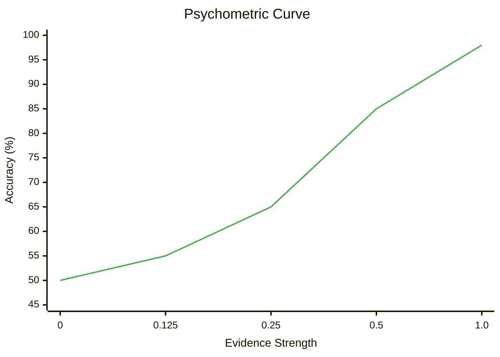
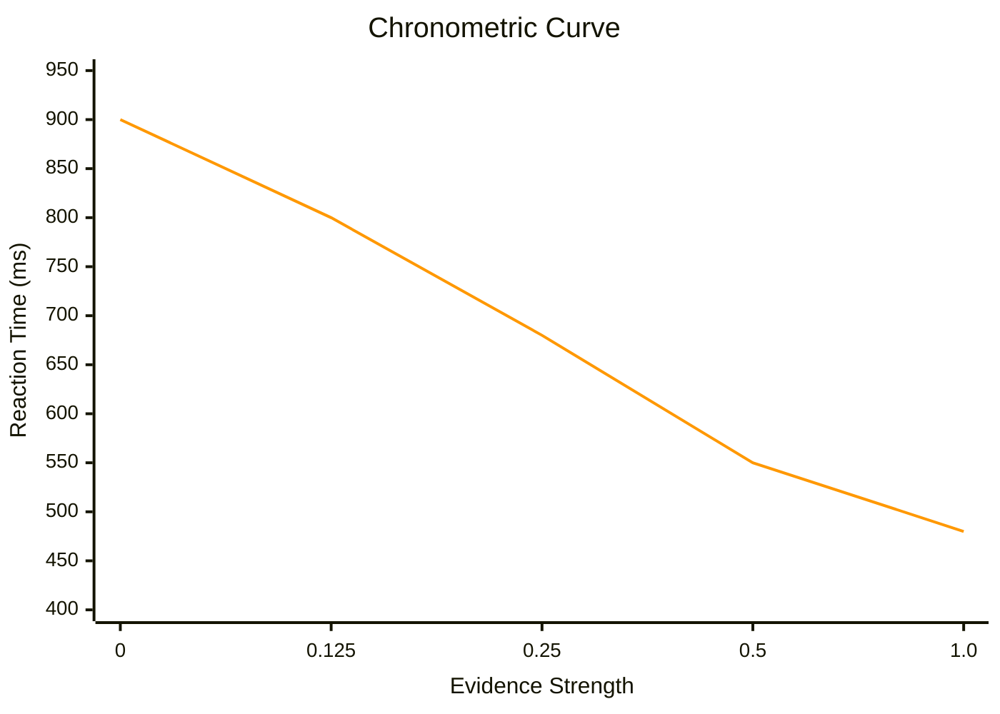
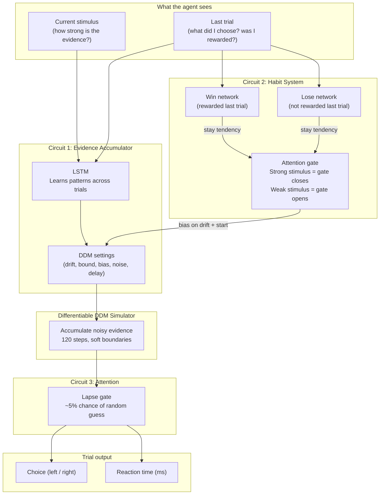
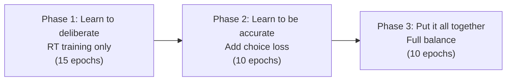

# Understanding AnimalTaskSim

## The Elevator Pitch

Picture a mouse in a lab. A faint striped pattern flashes on a screen — left side or right side? The mouse spins a wheel to answer. Get it right, get a drop of water. Get it wrong, wait in the dark.

Now picture an AI agent playing the same game, with the same rules, the same timing, the same rewards. Here is the question we care about:

**Does the AI play the game the way the mouse does?**

Not just "does it get the right answer" — but does it hesitate on the hard trials the same way the mouse does? Does it repeat a choice after being rewarded, the way a real mouse would? Does it occasionally botch an easy trial because it just wasn't paying attention?

That is what AnimalTaskSim measures. It is a faithful digital copy of real neuroscience experiments, built to test whether an AI agent can reproduce the *specific patterns* of animal decision-making — the hesitations, the habits, and the mistakes, not just the correct answers.

---

## Why Build This?

Most AI research asks: *"How do we make the smartest agent possible?"*

We ask a different question: *"Can we build an agent that makes decisions the way a real brain does?"*

**Why that matters:**

- **For neuroscience.** If a computer model reproduces a mouse's behavior pattern-for-pattern, we may have discovered something about how that mouse's brain actually works. The model becomes a testable theory of the brain — you can "lesion" a component of the model (remove or disable it) and predict what would happen if you did the same to the real brain.

- **For AI.** Biological brains are not perfect calculators, but they are remarkably good at handling uncertainty, adapting to change, and making fast-enough decisions with noisy information. Understanding *how* they do it could inspire more robust AI systems.

The key insight is that animals are not optimal decision-makers. They are influenced by what happened on the last trial, they occasionally zone out, and they take longer to decide when the evidence is weak. These "imperfections" are not bugs — they are signatures of specific brain circuits doing specific computations. We call the full pattern of these signatures a **behavioral fingerprint**.

---

## The Tasks

AnimalTaskSim recreates two classic experiments from neuroscience. Think of each one as a simple game with precise rules copied from real labs.

### Task 1: The Mouse Contrast Game (IBL 2AFC)

**The real experiment.** Developed by the [International Brain Laboratory](https://doi.org/10.1016/j.neuron.2021.04.001) and run in dozens of labs around the world. A mouse sits in front of a screen with a small steering wheel. A striped pattern appears on either the left or right side. The mouse spins the wheel to move the pattern to the center. Correct answer = a drop of water. Wrong answer = a brief wait in the dark.

**What makes it hard.** The pattern can be bold and obvious (high contrast, like black stripes on white) or so faint it is barely visible (low contrast, like light gray on slightly lighter gray). Low contrast trials are genuinely ambiguous — even the mouse's visual system cannot tell for sure which side the pattern is on.

**In the simulator.** The AI agent gets the same information the mouse would — a number representing how visible the pattern is and which side it appeared on — and must choose left or right. The trial timing, the reward rules, and even the way the lab shifts the odds between blocks of trials are all copied from the real protocol.

**Contrast levels used:** {0, 0.0625, 0.125, 0.25, 1.0} — five levels from invisible to unmistakable.

### Task 2: The Monkey Dots Game (RDM)

**The real experiment.** Based on landmark studies from the [Shadlen lab](https://doi.org/10.1523/JNEUROSCI.12-12-04740.1992) that helped discover how neurons accumulate evidence during decisions. A rhesus macaque watches a cloud of moving dots. Some dots move together in the same direction (left or right), while the rest wander randomly. The monkey decides which way the majority of dots are moving.

**What makes it hard.** When most dots agree (high coherence), the answer is obvious. When only a few dots agree (low coherence), it looks like television static and the monkey has to watch carefully, accumulating evidence over time before committing to an answer.

**In the simulator.** The agent gets a coherence value (0% = pure noise, 100% = all dots agree) and must choose left or right. Importantly, the agent also controls *when* to respond — just like the real monkey, it has to decide when it has gathered enough evidence to commit.

Both tasks ask the same basic question: **How do brains decide when the answer is not obvious?**

---

## The Scorecard: What Is a Behavioral Fingerprint?

We do not grade the AI the way you would grade a student ("what percentage did you get right?"). Instead, we look at **how it makes decisions** and check whether the patterns match what we see in real animals.

Five measurements, taken together, form the behavioral fingerprint:

### 1. The Accuracy Pattern (Psychometric Curve)

*"Does the agent get more accurate when the evidence gets stronger?"*

If you plot accuracy against evidence strength, you get a smooth S-shaped curve. Easy trials (strong evidence) produce near-perfect accuracy. Hard trials (weak evidence) produce near-random guessing. The steepness of the S-curve tells you how sensitive the decision-maker is — a steep curve means even small changes in evidence affect accuracy.

A real mouse has a specific steepness to its curve. Our agent should match it.


```mermaid
---
config:
  themeVariables:
    xyChart:
      plotColorPalette: "#4CAF50"
---
xychart-beta
    title "Psychometric Curve"
    x-axis "Evidence Strength" [0, 0.125, 0.25, 0.5, 1.0]
    y-axis "Accuracy (%)" 45 --> 100
    line [50, 55, 65, 85, 98]
```

> A **steeper slope** means higher sensitivity to evidence. A flat line at 50% would mean the agent is guessing no matter what.

### 2. The Speed Pattern (Chronometric Curve)

*"Does the agent slow down when the evidence is weak?"*

This is the hardest fingerprint to reproduce. Real animals take measurably longer to respond on difficult trials. Their brains are literally accumulating noisy evidence over time — like trying to figure out which way a crowd is walking by watching one person at a time. When the crowd is mostly going left, you figure it out quickly. When it is split nearly 50/50, you have to watch a lot longer.

A standard AI just outputs an answer instantly. It has no concept of deliberation time. Getting an agent to naturally slow down on hard trials — without being explicitly told to — requires the right internal machinery.


```mermaid
---
config:
  themeVariables:
    xyChart:
      plotColorPalette: "#FF9800"
---
xychart-beta
    title "Chronometric Curve"
    x-axis "Evidence Strength" [0, 0.125, 0.25, 0.5, 1.0]
    y-axis "Reaction Time (ms)" 400 --> 950
    line [900, 800, 680, 550, 480]
```

> A **negative slope** (slower for weak evidence, faster for strong evidence) is the hallmark of evidence accumulation — and the central challenge of this project.

### 3. History Effects (Win-Stay and Lose-Shift)

*"Is the agent influenced by what happened on the last trial?"*

A perfectly rational decision-maker would treat every trial as completely independent. Real animals do not. After a rewarded trial, a mouse tends to repeat its previous choice ("I went left and got water, so I will go left again"). After an unrewarded trial, it tends to switch ("I went right and got nothing, so let me try left").

These tendencies have names:

- **Win-stay:** The tendency to repeat a choice that was just rewarded. Think of it like a restaurant habit — you had a great meal at that Italian place, so you go back next Friday.
- **Lose-shift:** The tendency to switch away from a choice that was not rewarded. The sushi was bad, so you try Thai next time.

In mice, win-stay is much stronger than lose-shift (0.72 vs 0.47). This asymmetry reflects a real property of the dopamine system in the brain: reward signals are louder and more persistent than punishment signals.

### 4. Lapse Rate

*"Does the agent sometimes mess up on easy trials?"*

Even when the answer is completely obvious — a bold, high-contrast pattern on the left — a real mouse occasionally gets it wrong. Maybe it was grooming. Maybe it twitched. Maybe it just was not paying attention for a moment. These momentary disengagements happen on roughly 5-8% of trials.

A perfect AI would never do this. A biologically realistic AI should.

### 5. Bias and Commit Rate

*"Does the agent favor one side, and does it always give an answer?"*

A well-calibrated mouse has no strong left/right preference overall, and it responds on every trial (100% commit rate). Our agent should do the same.

---

## How the Agent's Brain Works

Standard reinforcement learning algorithms (like PPO, the kind used to train game-playing AIs) cannot produce realistic behavioral fingerprints. They respond instantly (no reaction times) and treat every trial independently (no history effects). We needed a different approach.

The solution has three independent circuits, each responsible for a different aspect of the behavioral fingerprint. This mirrors how real brains organize decision-making — different brain regions handle different parts of the process.

### Circuit 1: The Evidence Accumulator (DDM + LSTM)

**The core idea.** Imagine you are standing in a room during a rainstorm, trying to figure out if the wind is blowing left or right. Each raindrop that hits you gives a tiny clue — but each clue is noisy. Some drops splash left even when the wind is blowing right. So you wait, collecting evidence drop by drop, until you are confident enough to commit.

That is what a **Drift-Diffusion Model (DDM)** does. It is a mathematical model, originally developed to explain human and animal reaction times, that accumulates noisy evidence over time until it crosses a decision threshold.

The DDM naturally produces two key fingerprints:
- **The psychometric curve** — when more raindrops agree (strong evidence), the agent is more likely to get the right answer.
- **The chronometric curve** — when fewer raindrops agree (weak evidence), the agent takes longer to reach confidence.

But the DDM needs someone to set its dials: How sensitive should it be? How much evidence should it demand before committing? That is the job of the **LSTM** — a neural network that watches the stream of trials and adjusts the DDM's settings for each new trial. It outputs five parameters:

| DDM Setting | What It Controls | Brain Analogy |
|-------------|-----------------|---------------|
| Drift gain | How strongly evidence affects accumulation | Attention or gain modulation in sensory cortex |
| Decision bound | How much evidence is needed before committing | Speed-accuracy tradeoff (caudate/subthalamic nucleus) |
| Starting-point bias | Where accumulation begins (slight lean left or right) | Prior expectation (prefrontal cortex) |
| Noise level | How noisy the evidence stream is | Internal neural variability |
| Non-decision time | Motor delay before the response | Motor preparation time (motor cortex) |

### Circuit 2: The Habit System (Asymmetric History Networks)

**The problem.** In 70+ experiments, we found that the LSTM alone cannot produce history effects. Even when we explicitly trained it to reproduce win-stay and lose-shift behavior, the history signals it learned got drowned out during the DDM's evidence accumulation process. It is like trying to hear a whisper during a thunderstorm — the signal is there, but the noise of evidence accumulation washes it over.

**The solution.** Two small, separate neural networks — one for wins and one for losses — that bypass the LSTM entirely and directly nudge the DDM.

Why two networks instead of one? Because the brain handles rewards and punishments through different pathways. When a mouse gets a water reward, dopamine neurons in the ventral tegmental area fire strongly, creating a robust memory trace: "that action was good, do it again." When a mouse gets no reward, the signal is weaker and processed differently — through the lateral habenula and different dopamine circuits. The result: win-stay is much stronger than lose-shift (0.72 vs 0.47 in IBL mice). A single network processing both outcomes symmetrically cannot reproduce this asymmetry.

Each history network takes two inputs (what the agent chose last and whether it was rewarded) and outputs a single number: the **stay tendency** — how biased the agent should be toward repeating its previous choice.

The stay tendency reaches the DDM through two channels:

- **Starting-point bias.** Like leaning slightly toward one door before the evidence starts. This mostly affects ambiguous trials where the evidence is too weak to override the lean.
- **Drift-rate bias.** Like wearing tinted glasses that make left-favoring evidence look slightly stronger throughout the whole trial. This is the critical mechanism — it affects decisions at *all* difficulty levels, matching the observation that real mice show win-stay even when the stimulus is obvious.

An **attention gate** (`1 - |stimulus strength|`) controls how much the history bias is allowed through. When the stimulus is strong and obvious, the gate closes — sensory evidence dominates. When the stimulus is ambiguous, the gate opens — history has more influence. This prevents the history circuit from overwhelming the evidence circuit during training.

### Circuit 3: The Attention Lapse

Sometimes, a mouse is just not paying attention. Maybe it is grooming, or resting, or momentarily distracted. On those trials, it effectively guesses randomly.

We model this as a simple coin flip: on about 5% of trials, the agent ignores all evidence and picks left or right at random. This is a fixed rate, not something the agent can learn to adjust.

Why fixed? Because we tried making it learnable, and the optimizer cheated — it pushed the lapse rate up to 15%, using random guessing as a shortcut to reduce loss on hard trials. That is not how real attention works. Attention lapses are a property of the biological hardware, not a strategy the brain optimizes.

### The Three Circuits Together


```mermaid
flowchart TD
    subgraph Inputs["What the agent sees"]
        S["Current stimulus\n(how strong is the evidence?)"]
        H["Last trial\n(what did I choose? was I rewarded?)"]
    end

    subgraph Circuit1["Circuit 1: Evidence Accumulator"]
        L["LSTM\nLearns patterns across trials"]
        DDM_params["DDM settings\n(drift, bound, bias, noise, delay)"]
    end

    subgraph Circuit2["Circuit 2: Habit System"]
        WIN["Win network\n(rewarded last trial)"]
        LOSE["Lose network\n(not rewarded last trial)"]
        GATE["Attention gate\nStrong stimulus = gate closes\nWeak stimulus = gate opens"]
    end

    subgraph DDM_sim["Differentiable DDM Simulator"]
        P["Accumulate noisy evidence\n120 steps, soft boundaries"]
    end

    subgraph Circuit3["Circuit 3: Attention"]
        LAPSE["Lapse gate\n~5% chance of random guess"]
    end

    subgraph Output["Trial output"]
        C["Choice (left / right)"]
        R["Reaction time (ms)"]
    end

    S --> L
    H --> L
    H --> WIN
    H --> LOSE
    L --> DDM_params
    WIN -->|"stay tendency"| GATE
    LOSE -->|"stay tendency"| GATE
    GATE -->|"bias on drift + start"| DDM_params
    DDM_params --> P
    P --> LAPSE
    LAPSE --> C
    LAPSE --> R
```

**A single trial, step by step:**

1. The agent sees a new stimulus (say, a faint pattern on the left).
2. The LSTM looks at the stimulus features and its memory of recent trials, then sets the DDM's base parameters.
3. The history network checks: "Last trial, I chose right and got rewarded." The *win* network fires, producing a positive stay tendency — a nudge toward repeating "right."
4. The attention gate checks: "The stimulus is faint (low contrast), so I'll let the history bias through." The DDM's drift rate and starting point both get nudged toward "right."
5. The DDM simulator runs: noisy evidence accumulates step by step. The stimulus says "left" but the history bias says "right." After 85 steps, the evidence crosses the "left" threshold. Choice: left. Reaction time: 85 steps in simulated time.
6. The lapse gate rolls its 5% die. Not a lapse trial this time, so the DDM's answer stands.
7. Output: left, 650 ms.

---

## How the Agent Learns

### Why Training Order Matters

You might think: "Just show the agent a bunch of mouse data and train on everything at once." We tried that. It does not work.

The reason is that the different objectives — matching reaction times, matching accuracy, matching history effects — compete with each other during training. If you push for better accuracy too early, the agent learns to crank its evidence sensitivity way up, which flattens the chronometric curve (it decides instantly regardless of difficulty). If you push for history effects before the evidence circuit is stable, the history bias overwhelms the stimulus signal and accuracy collapses.

The solution is a **3-phase curriculum**, inspired by how real brains develop — basic sensory processing first, then more complex decision-making layered on top:


```mermaid
flowchart LR
    A["Phase 1: Learn to deliberate\nRT training only\n(15 epochs)"] --> B["Phase 2: Learn to be accurate\nAdd choice loss\n(10 epochs)"]
    B --> C["Phase 3: Put it all together\nFull balance\n(10 epochs)"]
```

**Phase 1 — Reaction times only.** The agent learns the basic mechanics of evidence accumulation: slow down on hard trials, speed up on easy ones. No pressure on accuracy yet.

**Phase 2 — Add accuracy.** Now the agent also gets penalized for wrong answers. It learns to map stimulus strength to drift rate — stronger stimulus = stronger evidence signal = more accurate choices.

**Phase 3 — Full balance.** All objectives active together: accuracy, reaction times, history effects, and drift magnitude regularization (which prevents the DDM parameters from collapsing to extreme values).

### Co-Evolution: Evidence and History Must Grow Up Together

A critical discovery: you cannot train the evidence circuit first and bolt on history effects later. When the evidence circuit learns without history bias present, it calibrates itself for a world without interference. Adding history bias afterward throws everything off — accuracy drops because the evidence circuit was not built to handle the extra push.

The fix: **co-evolution training**. History injection is active from the start of training, so the evidence circuit learns to be stronger to compensate. This required recalibrating the drift magnitude target from 6.0 to 9.0 — the LSTM learns to push harder on the evidence signal because it "knows" that history bias will be pulling in its own direction.

This parallels a real phenomenon in brain development: sensory circuits and reward circuits have to mature together. If you disrupt one during development, the other does not compensate properly.

### The DDM Simulator: Why We Simulate Instead of Calculate

The DDM has well-known mathematical equations for its output distributions. Why not just use those equations during training?

Because the optimizer cheats. Given analytical DDM equations, the agent discovered it could push the decision boundary to infinity and the drift rate to zero. This zeroes out the reaction-time gradient (the math says "boundary is infinite, so all gradients vanish") while still maintaining okay choice accuracy through a mathematical shortcut. The result: the agent times out on every trial and learns nothing useful.

The fix: instead of using closed-form equations, we run the actual evidence accumulation process as a **differentiable simulation** — 120 steps of stochastic evidence accumulation, implemented in PyTorch so gradients flow through every step. The agent cannot exploit mathematical shortcuts because there are no shortcuts — it has to actually accumulate evidence the honest way.

---

## Current Results

After 70+ experiments, five agent architectures, and one protocol correction that improved accuracy by 44%, here is where the agent stands against real IBL mouse data (5 random seeds, 10 reference sessions with 8,406 total trials):

| Metric | Agent (5-seed mean +/- std) | IBL Mouse (per-session) | Match? |
|--------|--------------------------|----------------------------|--------|
| Psychometric slope | 17.84 +/- 2.08 | 20.0 +/- 5.7 | Within 1 std |
| Chronometric slope | -37.7 +/- 2.4 ms/unit | -51 +/- 64 ms/unit | Within range |
| Win-stay | 0.734 +/- 0.022 | 0.72 +/- 0.08 | Within range |
| Lose-shift | 0.444 +/- 0.017 | 0.47 +/- 0.10 | Within range |
| Lapse rate | 0.086 +/- 0.049 | 0.08 +/- 0.07 | Within range |
| Bias | ~0.005 | ~0 | Match |
| Commit rate | 100% | 100% | Match |

> *Co-evolution training with history injection (win_t=0.30, lose_t=0.15, drift_magnitude_target=9.0), 3-phase curriculum, asymmetric history networks, 5% rollout lapse, corrected 5-contrast stimulus set. Reference derived from per-session analysis of 10 IBL sessions. See [FINDINGS.md](../FINDINGS.md) for the full story.*

**All five behavioral metrics fall within the per-session reference distribution.**

### Adaptive Control: The New Mechanism Under Test

The history-injection result above remains the best full behavioral match, but it does not solve learned history: the win/lose strengths are still supplied by hand. The next question became simpler and more biological:

**Can an agent learn when to persist, switch, or explore after uncertain outcomes?**

The adaptive-control agent adds a small control system on top of the evidence accumulator:

- the evidence core asks, "what does the stimulus say?"
- the outcome/value state asks, "what just happened?"
- the persistence state asks, "was that failure ambiguous enough that I should retry?"
- the exploration state asks, "is this context stale or uncertain enough to sample alternatives?"
- the arbitration head combines those pressures without letting them erase strong sensory evidence

The phase-1 result is intentionally narrow. In a 5-seed matched lesion suite, full adaptive control increased retry after weak-evidence failures relative to a clean no-control lesion:

| Condition | Psych slope | Chrono slope | Retry gap | Notes |
|-----------|-------------|--------------|-----------|-------|
| no-control lesion | 27.71 +/- 3.28 | -48.54 +/- 7.05 | 0.057 +/- 0.062 | adaptive state disabled |
| full adaptive control | 22.26 +/- 1.80 | -33.97 +/- 4.02 | 0.165 +/- 0.045 | 0/5 degenerate, 0/5 RT ceiling flagged |

Paired retry lift was `+0.109 +/- 0.086`, positive in 5/5 seeds.

This is legitimate as a computational result, but it is not a claim of exact brain anatomy. The analogy is: real brains likely use separate sensory, value, persistence, exploration, and arbitration-like computations. The model tests whether that computational separation can generate animal-like behavior.

The gate lesion sharpened the caveat. A linear uncertainty gate still worked somewhat (`+0.087 +/- 0.130`, positive in 3/5 seeds), while the nonlinear gate was stronger and more reliable. So the honest claim is not "the exponent 2 gate is necessary." The honest claim is "uncertainty-gated adaptive control is useful, and sharpening the gate improves robustness."

### What Is Not Solved Yet

| Gap | Detail |
|-----|--------|
| History is injected, not learned | The win-stay and lose-shift strengths (0.30 and 0.15) are hand-set numbers, not values the history networks discovered on their own. The architecture *can* express history effects, but it cannot yet *discover* them from data. |
| Adaptive control is an analogy | The new controller is lesion-tested in simulation, but it is not a neural anatomy claim and has not transferred to PRL/DMS yet. |
| Exploration is not isolated | Full control works better than no-control, but the exploration component still needs a cleaner necessary-role test. |
| Lapse variance across seeds | Lapse rates range from 0.043 to 0.156 across seeds, suggesting the lapse mechanism interacts with training dynamics in ways we do not fully understand. |
| Single task validated | Results are validated on IBL mouse only. The macaque RDM task produces correct reaction-time dynamics but lacks history effects (the macaque in the reference dataset was overtrained). |

---

## Lessons Learned (The Hard Way)

Over 70+ experiments, we hit 12 critical failure modes. Here are the most instructive:

| What Went Wrong | Why | What Fixed It |
|----------------|-----|---------------|
| Agent always answered instantly, no matter the difficulty | Reinforcement learning (PPO) optimizes for reward, not deliberation | Replaced RL with a DDM that must accumulate evidence over time |
| Win-stay stuck at chance (0.50) for months | A bug: the agent never received reward information between trials | Fixed one line: `phase_step == 1` instead of `== 0` |
| Accuracy collapsed when we added a fancy training curriculum | The complex 7-phase curriculum let the optimizer crank up noise to game the loss function | Switched to a simpler 3-phase curriculum |
| Agent learned to "lapse" on 15% of trials as a strategy | A learnable lapse parameter was exploited by the optimizer — random guessing reduces loss on hard trials | Made lapse a fixed, non-learnable parameter (5%) |
| Six months optimizing for history effects on the wrong task | The macaque in the reference data was overtrained and had no history effects to match | Switched to IBL mouse data, which has robust history effects |
| Accuracy improved 44% with zero model changes | The simulator included a contrast level (0.5) that does not exist in the real experiment | Removed the bogus contrast level to match the actual protocol |

The common theme: **most failures came from measurement or training pipeline bugs, not from the architecture being wrong.** Getting the infrastructure right was as important as getting the model right.

---

## Getting Started

### Just Want to See It in Action?

```bash
pip install -e ".[dev]"
python scripts/run_experiment.py   # Interactive wizard
```

### Want to Train the Flagship Agent Directly?

```bash
python scripts/train_hybrid_curriculum.py \
    --task ibl_2afc --seed 42 --episodes 20 \
    --drift-scale 10.0 --drift-magnitude-target 9.0 \
    --lapse-rate 0.05 \
    --history-bias-scale 2.0 --history-drift-scale 0.3 \
    --inject-win-tendency 0.30 --inject-lose-tendency 0.15 \
    --no-use-default-curriculum --no-allow-early-stopping \
    --phase1-epochs 15 --phase2-epochs 10 --phase3-epochs 10
```

Training runs on CPU in under 20 minutes.

### Want to Dig Into the Results?

- Browse `runs/` for experiment outputs
- Open any `dashboard.html` to see agent vs. animal comparisons
- Read [FINDINGS.md](../FINDINGS.md) for the full experimental narrative (70+ experiments, including all the failures)

### Want to Contribute?

1. Read [AGENTS.md](../AGENTS.md) for coding standards
2. Run `pytest tests/` (104 tests should pass)
3. Areas where help is especially welcome: teaching history networks to learn from data, lesion experiments (what happens when you remove each circuit?), new tasks (probabilistic reversal learning, delayed match-to-sample)

---

## Glossary

| Term | Plain-Language Meaning |
|------|----------------------|
| **2AFC** | Two-Alternative Forced Choice — pick left or right, no other options |
| **Chronometric curve** | A plot of reaction time vs difficulty — shows whether the agent slows down on hard trials |
| **Co-evolution** | Training the evidence and history circuits together from the start, so they learn to work alongside each other |
| **Coherence** | In the monkey dots task: what fraction of dots move in the same direction (more = easier) |
| **Contrast** | In the mouse task: how visible the striped pattern is (higher = easier to see) |
| **DDM** | Drift-Diffusion Model — a mathematical model of how brains accumulate evidence before making a decision |
| **Decoupling Problem** | The challenge of getting one agent to simultaneously produce realistic reaction times AND history effects |
| **Drift-rate bias** | A history-driven nudge that affects how evidence is processed throughout the whole trial, not just at the start |
| **Fingerprint** | The full pattern of accuracy, speed, history, and lapses that characterizes a particular decision-maker |
| **History effects** | How the outcome of the previous trial influences the current decision (win-stay, lose-shift) |
| **Lapse** | A trial where the decision-maker makes an error despite strong evidence — usually due to momentary inattention |
| **LSTM** | Long Short-Term Memory network — a type of neural network that remembers patterns across a sequence of events |
| **Psychometric curve** | A plot of accuracy vs evidence strength — shows how sensitive the decision-maker is |
| **RDM** | Random-Dot Motion — the monkey dot-direction task |
| **RT** | Reaction Time — how long it takes to respond |
| **Stay tendency** | How biased the agent is toward repeating its previous choice |

---

## Further Reading

**The Science Behind the Project:**
- Ratcliff & McKoon (2008). *Neural Computation* — The mathematical foundations of drift-diffusion models
- International Brain Laboratory (2021). *Neuron* — The standardized mouse decision-making task
- Britten et al. (1992). *Journal of Neuroscience* — The classic monkey dot-motion experiment
- Urai et al. (2019). *Nature Communications* — How past outcomes bias future decisions in animals

**Project Documentation:**
- [FINDINGS.md](../FINDINGS.md) — The full experimental narrative (70+ experiments, all failures documented)
- [AGENTS.md](../AGENTS.md) — Developer guide and coding standards
- [README.md](../README.md) — Installation and quickstart
