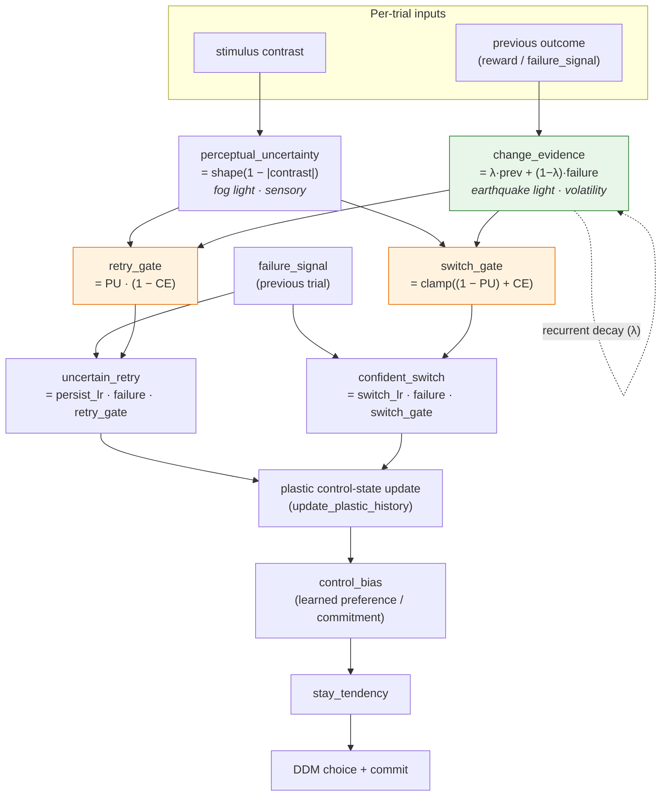

# Design Note: Change-Evidence Gating for Adaptive Control

**Status:** IMPLEMENTED AND CALIBRATED (June 1, 2026), flag-gated
`change_evidence_enabled` (default off). Design history below kept for
provenance. Flag-off is a verified bit-for-bit no-op. Safety-gated validation
rejected λ=0.7 as too eager and selected λ=0.9 as the leading opt-in
combined-profile candidate: with `uncertain_retry` still enabled, full-control
PRL block-learning lift reaches `+0.469` and optimal choice reaches `0.706`;
IBL full-control retry gap reaches `0.115` versus the historical flag-off
`0.165`, so the feature is not promoted to a default.
**Date:** May 30, 2026 (rev. June 1, 2026)
**Supersedes:** v1 of this note, which folded everything into a single
`uncertainty` dial. That was wrong — see Section 2. v2.1 added the per-trial
update order (4a), the stored-perceptual state flow (Section 7), an explicit
disabled branch + decay validation (Section 8), and a recovery-sequence test
(Section 9). v2.2 corrected the transition-table arithmetic to match the
update order (every failure forces `change_evidence ≥ 0.30` at λ=0.7), added the
λ-crossover calibration note, fixed raw-vs-shaped representation, and made decay
validation an explicit `raise ValueError`.
**Depends on:** confirmed PRL perseveration mechanism (FINDINGS.md, "PRL
Perseveration Mechanism Confirmed — May 30, 2026").

---

## 1. Problem

The adaptive controller's uncertainty signal is **stimulus-derived**:

```python
uncertainty = _shape_uncertainty(1.0 - |contrast|)
```

Sensible in IBL (a faint stimulus = a genuinely hard trial). Degenerate in PRL,
where both options are visually neutral, so `contrast = 0` always and
`uncertainty` is pinned at `1.0` forever (the diagnostic showed
`control_gate = 1.000` in every window). That pins the two outcome-driven gates:

```python
uncertain_retry  ∝ uncertainty        # high uncertainty → RETRY the failed action
confident_switch ∝ (1 - uncertainty)  # high uncertainty → SWITCH less
```

→ `uncertain_retry` fires at full strength on every PRL failure (perseveration);
`confident_switch` is dead. The 5-seed ablation confirmed this is the cause.

## 2. The correction (v1 was wrong)

v1 proposed defining `uncertainty = recent failures` (volatility). **This is
sign-inverted.** In the existing model, high uncertainty means *"hedge by
repeating."* So feeding recent failures into `uncertainty` would, after a
reversal, drive failures → higher uncertainty → **more** retrying of the failed
option. It makes perseveration *worse*. (Credit: this was caught in review.)

Two signals are needed, with **opposite** effects on the gates:

- **`perceptual_uncertainty`** — *"is the picture unclear?"* (the **fog light**).
  Sensory. Drives *retry* (a failure on a blurry trial is probably noise).
- **`change_evidence`** — *"have surprising failures been piling up?"* (the
  **earthquake light**). Volatility. Drives *switching* (the world changed).

A single scalar cannot serve both, because they pull the retry gate in opposite
directions.

### Why `change_evidence` must be an accumulator, not a per-trial signal

PRL is **probabilistic**: the good option still fails ~20% of the time. A switch
rule that triggers on a single failure-while-confident would flip after one
unlucky loss → chronic instability. So `change_evidence` must *accumulate* —
switch only when losses pile up beyond what normal bad luck explains. This is
the decisive reason the signal is a decaying failure count, not an instantaneous
read.

### On "choice confidence" (the value gap)

Review proposed a `choice_confidence` dial from the learned value gap
(`selected_control − alternative_control`). Two notes:

1. v1 claimed this gap "collapses immediately after a reversal." **It does not** —
   the agent cannot see the hidden swap; the gap stays *confidently wrong* until
   losses erode it through `update_plastic_history`. That claim was false.
2. The value gap is **already** expressed in the model as `control_bias`, which
   biases the choice toward the learned-better option. So commitment is already
   represented. We therefore keep the two *gate-driving* signals as
   `perceptual_uncertainty` + `change_evidence`, and treat an explicit
   value-gap modulation of the switch gate as an **optional follow-up**, not part
   of the first cut. Reason: the retry behavior IBL depends on is *perceptual*
   (contrast), so replacing perceptual_uncertainty with value-gap confidence
   risks breaking IBL; adding change_evidence does not.

## 3. The two signals

### 3a. `perceptual_uncertainty` (kept, renamed for honesty)

```
perceptual_uncertainty = shape_uncertainty(1 - |contrast|)   # unchanged math
```

### 3b. `change_evidence` (new, recurrent, causal)

A decaying accumulator over **past** committed outcomes:

```
change_evidence_t = λ · change_evidence_{t-1} + (1 − λ) · failure_t
```

- `failure_t ∈ {0, 1}` from the just-resolved committed trial (strictly past
  information — no current-trial reward leakage).
- `λ` is a **fixed** hyperparameter (default 0.7), not learnable (the project's
  rule: unconstrained learnable gates get exploited by the optimizer).
- With λ=0.7, four straight post-reversal losses drive change_evidence to ≈0.76;
  a single fluke loss in a winning run bumps it to ≈0.30 then decays back under
  0.15 within ~3 trials. That gap is what separates "reversal" from "bad luck."

## 4. Gate redefinition

```
retry_gate  = perceptual_uncertainty · (1 − change_evidence)
switch_gate = clamp( (1 − perceptual_uncertainty) + change_evidence , 0, 1 )

uncertain_retry  = persistence_lr · failure · retry_gate  · trace
confident_switch = switch_lr      · failure · switch_gate
```

**Reduces exactly to current behavior when `change_evidence = 0`:**
`retry_gate → perceptual_uncertainty`, `switch_gate → 1 − perceptual_uncertainty`.
So with the feature disabled (`change_evidence ≡ 0`), the model is bit-for-bit
identical to today — that is the safe default (Section 8 specifies how the
disabled path is implemented).

### 4a. Update order (per-trial recurrence — resolves the off-by-one)

The gates that update the plastic memory react to the **just-resolved** trial.
The order is fixed and explicit: update `change_evidence` **first** (so the
current failure counts toward its own gate — this makes reversal detection one
trial faster), then evaluate the gates, then update the plastic state, then run
the current forward pass, then store state for the next trial.

**Representation convention:** the carried perceptual signal is the **raw gate**
`1 - |contrast|`, shaped at point of use (`shape_uncertainty`). This matches the
existing code (`prev_history_gate` is raw; `update_plastic_history` shapes it) and
prevents accidental double-shaping. The state variable is named
`prev_perceptual_gate` to make "raw" explicit.

```text
# State carried across trials:
#   plastic_state, change_evidence, prev_perceptual_gate   # gate = RAW 1-|contrast|
# All gates use PAST outcomes only (causal).

def step(contrast_t, reward_prev, committed_prev, state):
    # --- 1. Resolve the PREVIOUS trial's outcome into plastic memory ---
    failure = 1.0 if (committed_prev and reward_prev <= 0.0) else 0.0

    # update change_evidence FIRST (include this failure in its own gate)
    change_evidence = lambda_ * state.change_evidence + (1 - lambda_) * failure

    # shape the stored RAW gate of the PREVIOUS trial (the trial that failed)
    pu_prev       = shape_uncertainty(state.prev_perceptual_gate)
    retry_gate    = pu_prev * (1 - change_evidence)
    switch_gate   = clamp((1 - pu_prev) + change_evidence, 0.0, 1.0)
    plastic_state = update_plastic_history(plastic_state, failure,
                                           retry_gate, switch_gate)

    # --- 2. Act on the CURRENT trial ---
    raw_gate_cur = 1 - abs(contrast_t)
    out          = forward(contrast_t, plastic_state,
                           current_gate=shape_uncertainty(raw_gate_cur))

    # --- 3. Carry state forward ---
    state.change_evidence      = change_evidence
    state.prev_perceptual_gate = raw_gate_cur   # RAW; shaped next step at use
    return out, state
```

When `change_evidence_enabled=False`, step 1 takes the existing code path
verbatim (`change_evidence` is never read; the gate uses the current
`1 - |contrast|` exactly as today).

## 5. Transition table (the cases the review asked for)

Gates only matter on a failed trial, so `failure = 1` in every row. Per the
update order (4a), `change_evidence` already includes the current failure, so at
λ=0.7 it is **at least 0.30 on any failure** (`0.7·0 + 0.3·1`). The `CE` column
below is this post-update value; the streak rows assume consecutive losses from a
low base.

| scenario | task | PU | CE (post-update) | retry_gate | switch_gate | intended action |
|---|---|---:|---:|---:|---:|---|
| Hard trial, isolated failure | IBL | 0.90 | 0.30 | 0.63 | 0.40 | **retry** (failure likely sensory noise) |
| Easy trial, isolated failure | IBL | 0.10 | 0.30 | 0.07 | 1.00 | **switch** (clear stimulus, genuine error) |
| Isolated loss (1st, any block phase) | PRL | 1.00 | 0.30 | 0.70 | 0.30 | **retry** (don't overreact to one loss) |
| 2nd consecutive loss | PRL | 1.00 | 0.51 | 0.49 | 0.51 | **switch** — crossover (see note) |
| 4th consecutive loss after reversal | PRL | 1.00 | 0.76 | 0.24 | 0.76 | **switch** (world changed, abandon stale choice) |

The two IBL rows preserve current logic (retry on ambiguous failures, switch on
clear-stimulus errors), just with thinner margins because CE≥0.30. The PRL rows
are the new behavior. The decisive contrast is **isolated loss (CE 0.30) vs 4th
consecutive loss (CE 0.76)** at identical PU=1.0: accumulation, not the failure
itself, is what flips retry→switch.

> **λ calibration (flagged for the recovery test).** At λ=0.7 the retry→switch
> crossover (`CE > 0.5`) lands on the **2nd** consecutive loss. On an 80/20
> option two unlucky losses in a row occur ~4% of the time, so λ=0.7 is probably
> too eager. λ=0.8 pushes the crossover to ~4 losses (single 0.20, 2nd 0.36,
> 3rd 0.49, 4th 0.59) — far more robust to normal bad luck. The exact λ is an
> implementation-tuning decision; Section 9's recovery-sequence test is the
> instrument that sets it. The default in Section 8 should be revisited against
> that test, not treated as final.

## 6. Architecture



Green = the one new signal; orange = the redefined gates. Everything downstream
of the plastic update is unchanged.

## 7. Timing contract (must be preserved)

There are **two gates at two timesteps**, and they must not be collapsed:

- **Previous-trial gate** updates the plastic memory from the *last* outcome
  (`update_plastic_history`, fed by `prev_history_gate`). `change_evidence` and
  the retry/switch gates above live here — they react to outcomes already seen.
- **Current-trial gate** controls the *current* action (`forward`, `control_gate`
  from the current contrast).

When centralizing (Section 8), name state explicitly `previous_change_evidence`
→ `next_change_evidence`, mirroring the existing `prev_*`/`next_*` plastic state.
Conflating the two timesteps is exactly the class of error that produced the
`prev_reward = 0.0` bug — treat it as the primary implementation hazard.

**The model must store the previous perceptual gate.** The plastic update needs
the perceptual context of the *trial that failed*, not the current one. Today the
trainer supplies this via `prev_history_gate` (the **raw** `1 - |contrast|`);
once the logic moves into the model, the model cannot reconstruct it and must
carry it in state. The flow is:

```text
prev_perceptual_gate (raw) ──shape──▶ plastic/history update (resolves last outcome)
current contrast ──▶ raw_gate_cur ──shape──▶ forward pass (gates current action)
                      raw_gate_cur ──▶ stored as prev_perceptual_gate for next trial
```

`prev_perceptual_gate` (raw) joins `change_evidence` in the carried state tuple;
both are seeded to 0.0 in `init_plastic_state`. Shaping happens only at point of
use, never on the stored value (Section 4a).

## 8. Centralization & backward compatibility

Today `1 − |contrast|` is rebuilt in **four** places (model `forward` line 235;
`prev_history_gate` in trainers at adaptive_control line 173, hybrid lines 553 &
1207). That scatter is a train/rollout-consistency hazard. The fix must:

- Compute `perceptual_uncertainty` and update `change_evidence` **inside the
  model's plastic recurrence**, returned alongside the existing state tuple
  (`plastic_state, eligibility_trace, prev_value_prediction, prev_history_gate`
  → add `change_evidence`). Trainers stop hand-building gates.
- Gate the whole thing behind a config flag, default = current behavior:

  ```python
  change_evidence_enabled: bool = False
  change_evidence_decay: float = 0.7   # λ, fixed
  ```

  `change_evidence_decay` is **validated in `__post_init__`**: `raise ValueError`
  if outside `[0, 1]` (reject, do not clamp), matching the existing
  config-validation pattern (`PRLConfig`, `ContingencyBlock`).

- **Implement the disabled path as an explicit branch, not multiply-by-zero.**
  The requirement is bit-for-bit identity when off. Rather than relying on
  `change_evidence = 0` flowing through the new `(1 − CE)` / `+ CE` / `clamp`
  arithmetic to reproduce the old floats, keep the original equations under an
  explicit guard:

  ```python
  if not self.change_evidence_enabled:
      # original code path, unchanged
      retry_gate, switch_gate = uncertainty, 1.0 - uncertainty
  else:
      retry_gate  = pu_prev * (1.0 - change_evidence)
      switch_gate = torch.clamp((1.0 - pu_prev) + change_evidence, 0.0, 1.0)
  ```

  This guarantees the no-op and makes the diff auditable.

- Adding the flags auto-exposes new tyro CLI options. **Explicit contract
  decision:** *additive* optional flags with safe defaults are permitted
  (existing arg names, defaults, and behavior are untouched); same pattern as
  `uncertain_retry_enabled`. The frozen contract forbids *changing* existing
  surfaces, not adding opt-in ones.

## 9. Validation plan (the guardrail — order matters)

1. **IBL non-regression, flag off.** 5-seed IBL must match current numbers
   *exactly* (psych ~17.8, chrono ~−37, WS ~0.73, LS ~0.44, lapse ~0.09). Proves
   the default is a true no-op.
2. **IBL, flag on.** 5-seed IBL must stay within the reference distribution. If
   it degrades, the change is unsafe for the shared core — stop.
3. **PRL, flag on, `uncertain_retry` left ENABLED.** Success = `block_learning_lift`
   and `optimal_choice_rate` improve toward/past the `uncertain_retry`-off
   ablation (~+0.30 lift, ~0.59 optimal) **without** disabling the term — i.e. the
   retry gate now self-closes as change_evidence rises.
4. **Unit tests:** `change_evidence` is causal (no current-trial leakage),
   monotonic in failure streak, decays toward 0 under wins; gates reduce to the
   current formulas when `change_evidence = 0` (and the explicit disabled branch
   is bit-for-bit identical); `change_evidence_decay` outside `[0, 1]` is
   rejected; the transition-table rows produce the expected retry/switch ordering.
5. **Recovery-sequence test (the design's risk case).** Drive a full arc on one
   batch element and assert the gate *trajectory*, not just endpoints:
   `stale-choice losses → switch_gate rises, agent abandons stale option →
   several wins on the new option → change_evidence decays back low → an
   occasional unlucky loss yields retry_gate high / switch_gate low (stays,
   does NOT switch back) → stable recovery`. This is where too-slow decay (λ too
   high) would betray itself as oscillation; the test pins the intended
   no-switch-back behavior and would flag a λ that needs tuning.

## 10. Success / failure criteria

| outcome | meaning |
|---|---|
| IBL identical (flag off) **and** in-distribution (flag on) **and** PRL improves with `uncertain_retry` ON | **Win** — uncertainty now means the right thing; the controller self-regulates across a stable and a volatile task with one rule. |
| IBL degrades (flag on) | Unsafe for shared core. Restrict to PRL via task flag, or rework. |
| PRL flat with `uncertain_retry` ON | change_evidence isn't reaching the gates effectively → revisit injection (Section 8) before signal definition. |

## 11. Out of scope (this step)

- Claiming PRL animal parity. The repository has no PRL animal reference
  dataset; the new ~0.71 in-simulator optimal-choice result is a transfer probe,
  not a parity result.
- Explicit value-gap (`choice_confidence`) modulation of the switch gate —
  deferred follow-up (Section 2).
- Learnable λ or learnable blend weights (optimizer-exploitation risk).
- Any change to IBL/RDM defaults or frozen CLI/schema surfaces.

## 12. Related cleanups (surfaced in review, tracked separately)

- **Diagnostic skip-logic:** resolved. `prl_arbitration_diagnostic.py` now
  skips a reroll only when the completion manifest exists and row counts match,
  so an interrupted sidecar cannot be summarized as complete.
- **Matplotlib backend:** report tests can abort on some macOS setups if a GUI
  backend is selected; add `matplotlib.use("Agg")` for headless robustness. (The
  full suite passes 176/176 in the current dev environment.)

## 12a. Validation result — June 1, 2026

The safety sequence was run in order: IBL first, then PRL only for viable λ
settings. PRL was intentionally skipped for λ=0.7 after it failed the IBL gate
and for λ=0.85 after it was dominated by λ=0.8.

| λ | IBL full-control retry gap | PRL full-control block-learning lift | interpretation |
|---|---:|---:|---|
| flag off | 0.165 | -0.044 | historical baseline |
| 0.70 | 0.066 | not run | too eager |
| 0.80 | 0.099 | +0.379 | viable first rescue |
| 0.85 | 0.091 | not run | dominated |
| 0.90 | **0.115** | **+0.469** | leading opt-in combined profile |

At λ=0.9, IBL psychometric and chronometric fingerprints remain healthy, with
zero degenerate runs and zero reaction-time ceiling warnings. All adaptive PRL
conditions beat no control on paired block-learning lift in 5/5 seeds while
`uncertain_retry` stays enabled. This is the intended win: one state-dependent
rule now regulates retry versus switch behavior across both tasks. The
remaining IBL retry-gap shortfall is why the feature stays default off.

## 13. Why this is the right next step

The `uncertain_retry` ablation proved *what* breaks PRL but left a band-aid
switch. This removes the band-aid by fixing the root cause — a sensory signal
masquerading as a general one. Having cleared the Section 9 safety sequence, it
now makes one controller behave sensibly in both a stable perceptual task and a
volatile reversal task. That cross-task robustness, not raw PRL score, is the
scientific payoff: evidence that uncertainty/change-gated arbitration is a
*general* adaptation mechanism, not an IBL-specific fit. The remaining IBL
retry-gap shortfall still keeps the result opt-in.
